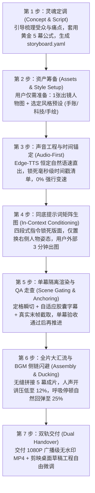

# human-ai-video-director：人机协同 AI 短视频工业化制作工坊

这是一个专为 **“用户外部生成式 AI 武器库 + Agent 本地确定性工程工具”** 打造的工业级短视频全流程制作 Skill。

不再陷入“纯代码硬搓假人立牌的塑料生硬感”或“纯大模型生视频汉字乱码形变”的两难困境，而是将两者优势在毫秒级时间轴上完美咬合：
- **生成式 AI（Grok / Midjourney / Gemini）负责“印刷级质感与生动神态”（灵魂）**；
- **确定性工程（studio CLI / Edge-TTS / Remotion / HyperFrames / 剪映）负责“分秒不差的排版与交互”（骨骼）**。

---

## 🚀 一、 新用户保姆级 7 步全流程指引 (Full-Lifecycle Onboarding Guide)

当新用户安装本 Skill 并发起视频制作请求（例如：*“我想做一个视频”*、*“帮我把这个产品功能做成宣传片”*）时，Agent **必须自动扮演“AI 视频总导演”角色**，按以下 7 步主动推进：



### 步骤详情与 Agent 引导话术：

#### 💬 第 1 步：定内容（灵魂定调）
- **Agent 引导动作**：主动询问用户的**产品/主题、目标受众、最扎心的 1~2 个痛点**。
- **标准化输出**：自动将用户内容拆解为符合高完播率的 **黄金 5 幕短视频骨架**（单字发音基准 `0.14s~0.16s`，全片时长严格锁定在 `50s ~ 65s`）：
  - **Act 1（痛点觉醒 · 10~12s）**：突发冲突、共情暴击、打破平衡（如：每天上班3小时在催数据？）；
  - **Act 2（破局重塑 · 12~14s）**：心理减负、引入主角、全景地图（如：别当人肉打字机，搭个 AI 外挂）；
  - **Act 3（拟真对战/实战 · 12~14s）**：极客对决、深度体验、零险排雷（如：拖入节点，10秒全自动搞定）；
  - **Act 4（深度诊断/心法 · 14~17s）**：残暴打分、颠覆认知、干货解法（如：黄金三步心法：节点化/规则化/标准化）；
  - **Act 5（通关号召 CTA · 9~11s）**：终极爽感、能力升华、立即行动（如：今天就动手，开启超级个体时代）。
- **自动化产出**：在终端执行 `python -m studio init <project_name>`，生成标准脚手架与 `storyboard.yaml`。

#### 📦 第 2 步：备物料（资产极简化筹备）
- **Agent 明确提示用户**：*“请放心，你不需要昂贵设备，只需准备以下 3 项极简物料：”*
  1. **出镜人物基准图（1 张即可）**：你的真实自拍、证件照或 AI 虚拟角色形象（用于锁定发型、眼镜、五官与服饰）；
  2. **选定视觉风格预设**：
     - `journal_scrapbook`（经典杂志手账风 · 暖米白纸底 `#FAF7F2` + 思源粗黑排版 + 荧光橙马克笔）；
     - `modern_tech`（现代科技 SaaS 风 · 深色极客网格 `#0F172A` + 霓虹微光连线 + 等宽代码字体）；
  3. **核心功能截图（1~2 张可选）**：想要展示的软件界面、Logo 或成果报表。

#### 🎙️ 第 3 步：锁节奏（声音工程先行）
- **Agent 执行**：`python -m studio audio build --project <project_name>`。
- **技术规约**：
  - 微软官方拟真神经网络声线：`zh-CN-YunxiNeural`（阳光亲和青年男声）、`zh-CN-YunjianNeural`（沉稳专家男声）、`zh-CN-XiaoxiaoNeural`（温暖知性女声）；
  - 统一配置恒定自然语速（`rate=+18% ~ +20%`），自动剔除头尾杂音，保留舒适呼吸气口（0.25~0.35s）；
  - 导出全片唯一真理源 `timestamps_manifest.json`，毫秒级标定台词起止点。
  - **绝对红线**：**0% 逐句 atempo 强行变速！声音自然流淌，画面适配声音。**

#### 🎨 第 4 步：生画卷（同底多姿态提示词矩阵）
- **Agent 执行**：`python -m studio prompt generate --project <project_name>`，导出 `MASTER_PROMPTS.md`。
- **用户操作（仅需 3~5 分钟）**：
  - 打开 Grok / Midjourney / Gemini，粘贴 Agent 生成的**四段式标准指令**；
  - 严格保持第一张母版画卷的背景网格、装订折痕、左侧便签卡片与文字 100% 锁定，仅置换右侧人物动作与表情；
  - 将生成的同底画卷放入 `assets/masterframes/`。

#### 🎬 第 5 步：跑单幕（单幕隔离渲染与 QA 走查）
- **Agent 执行**：`python -m studio render scene --project <project_name> --scene 1`。
- **核心规约**：
  - 纯正手账定格抽帧瞬切（Jump Cut），杜绝恶心代码正弦微晃；
  - 自适应圆角胶囊字幕，字音同源，超宽自动等比降号熔断防截断；
  - 自动抽取关键帧至 `output/qa_frames/` 供 5 秒走查；
  - 自动将真实最后一帧截取保存至 `assets/anchors/scene_01_end.png` 作为下一幕 2.5D 物理翻书的底板。用户确认满意后再推进下一幕！

#### 🎚️ 第 6 步：总汇流（全片拼接与 BGM 动态闪避）
- **Agent 执行**：`python -m studio assemble --project <project_name>`。
- **技术要点**：
  - 5 幕独立视频无损拼接；
  - 挂载 BGM，应用 FFmpeg 动态侧链闪避（Sidechain Ducking）：人声讲话时 BGM 自动压低至 12%，停顿气口平滑回弹至 25%。

#### 📦 第 7 步：双交付（全案交付与二次精修）
- **交付物 1**：1080P / 30fps 广播级高清零水印成片（即刻可分发）；
- **交付物 2**：联动 `video_tools_ecosystem/mcp_chatcut_desktop`，生成剪映 / CapCut 桌面草稿工程，所有轨道分层开放，用户可随时在剪映客户端用鼠标自由拖拽微调。

---

## ⚡ 二、 HyperFrames 代码动效引擎安装与集成指南

当项目中需要复杂的 WebGL、GSAP 复杂镜头动效、3D 手机壳悬浮翻转或前端交互录屏时，强烈推荐使用 **HyperFrames**：

### 1. 下载与安装方式 (Installation)
HyperFrames 基于 Node.js / Web 渲染生态，安装方式如下：

```bash
# 全局安装 HyperFrames CLI 工具链
npm install -g hyperframes

# 或者使用 npx 免安装即时运行
npx hyperframes --version
```

### 2. 常用开发与质检命令 (CLI Commands)
```bash
# 1. 语法与 Schema 严密校验 (确保所有时间轴标签、媒体引用合规)
npx hyperframes check ./my_hyperframes_project

# 2. 本地实时交互式时间轴预览
npx hyperframes preview ./my_hyperframes_project

# 3. 极速提取关键帧画卷走查 (Contact Sheet)
npx hyperframes snapshot ./my_hyperframes_project -o ./qa_frames.jpg

# 4. 智能一键去背抠图 (提取高精度纸片人切片)
npx hyperframes remove-background input.png -o output_clean.png

# 5. 无头浏览器高保真 60fps 渲染导出
npx hyperframes render ./my_hyperframes_project -o ./output/video.mp4
```

---

## 🧰 三、 视频制作工具箱生态矩阵 (`video_tools_ecosystem/`)

本项目内置了完整的周边视频创作工具箱生态，位于 `video_tools_ecosystem/` 目录：

1. **`mcp_chatcut_desktop/`**：剪映 / CapCut 桌面端双向交互 MCP 协议中枢，内置 60 个原子工具 Schema 与操作指南。
2. **`companion_skills/`**：收录 8 大顶尖开源视频制作 Skills：
   - **`srt-whiteboard-animation`**（[geeklee](https://github.com/geeklee/srt-whiteboard-animation)）：暖白纸流墨手绘白板动画；
   - **`anything2explainer`**（[Vincentwei1021](https://github.com/Vincentwei1021/anything2explainer)）：黑底极简科技感讲解视频；
   - **`video-shotcraft`**（[Vincentwei1021](https://github.com/Vincentwei1021/video-shotcraft)）：157+ 镜头配方卡与 2.5D 动效分镜工坊；
   - **`stickman-video-director`**（[kaomei](https://github.com/kaomei/stickman-video-director)）：火柴人叙事视频导演；
   - **`hand-drawn-video-prompts`**（[kaomei](https://github.com/kaomei/hand-drawn-video-prompts)）：暖白底 Q 版蜡笔手绘 9:16 分镜；
   - **`cut-director`**：口播剪辑与智能画中画弹窗导演；
   - **`ffmpeg-video-editor`**：FFmpeg 原子剪辑与高保真转码工具；
   - **`yh-tools-video2srt`**：视频快速提取字幕与语音识别工具。

---

## 🛑 四、 六大不可逾越工程红线 (The 6 Non-Negotiables)

1. **【绝不擅自合并总片】**：单幕精调必须独立交付，经走查满意后方可推进下一幕。
2. **【绝不逐句强行变速】**：严禁滥用 `atempo` 橡皮筋拉伸单句，声音自然流淌，画面适配声音。
3. **【绝不切文字区做羽化】**：严禁在带有文字、卡片的区域做代码 Alpha 羽化拼合，100% 同底整页直出。
4. **【绝不添加代码正弦微晃】**：严禁人物正弦摆动、骨骼扭动，坚守手账实体定格抽帧瞬切（Jump Cut）。
5. **【字音毫秒同源绝对对应】**：字幕文本与配音文本单一数据源，字幕区间由配音实际波形起止点驱动。
6. **【必须输出 QA 关键帧走查】**：自动抽取动作切换点与转场帧，肉眼复核文字锐度后方可汇报交付。
