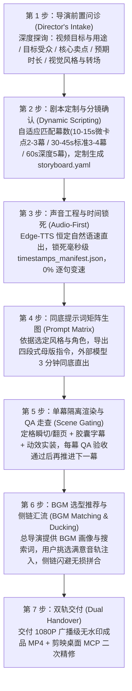

# human-ai-video-director：人机协同 AI 短视频工业化制作工坊

这是一个专为 **“用户外部生成式 AI 武器库 + Agent 本地确定性工程工具”** 打造的工业级短视频全流程制作 Skill。

不再陷入“纯代码硬搓假人立牌的塑料生硬感”或“纯大模型生视频汉字乱码形变”的两难困境，而是将两者优势在毫秒级时间轴上完美咬合：
- **生成式 AI（Grok / Midjourney / Gemini）负责“印刷级质感与生动神态”（灵魂）**；
- **确定性工程（studio CLI / Edge-TTS / Remotion / HyperFrames / 剪映）负责“分秒不差的排版与交互”（骨骼）**。

---

## 🚀 一、 导演级 7 步人机协同工作流 (The 7-Step Director's Protocol)

当用户发起视频制作需求（如：*“我想做个宣传片”*、*“帮我把这个产品做成视频”*）时，Agent **必须严格扮演“专业 AI 视频总导演”角色**，禁止自作主张固定模板，禁止硬塞预设！必须按以下 7 步严谨推进：



---

### 步骤详情与总导演执行规约：

#### 🎬 第 1 步：导演前置问诊 (Director's Intake & Vision Alignment)
- **【总导演核心红线】**：**严禁擅自假定视觉风格！严禁死板硬套 5 幕！严禁擅自塞入硬编码 BGM！**
- **主动探询四大核心维度**（若用户诉求未明确说明，必须先向用户提问）：
  1. **【用途与受众】**：视频核心用途是什么？（电商带货种草、功能演示、品牌官宣、知识干货拆解、纯搞笑解压？）核心受众是谁？（打工人、学生、技术开发者、年轻白领、企业高管？）
  2. **【时长与幕数节奏】**：
     - **10s ~ 15s 极速微短片 / 爆款卡点**：适配 **2 ~ 3 幕**（痛点钩子 ➔ 核心解法/亮点 ➔ 立即行动 CTA）；
     - **30s ~ 45s 中短视频 / 功能拆解**：适配 **3 ~ 4 幕**（痛点觉醒 ➔ 破局解法 ➔ 实战演示 ➔ 总结升华）；
     - **50s ~ 65s 深度干货 / 标杆大片**：适配 **黄金 5 幕**（痛点觉醒 ➔ 破局重塑 ➔ 拟真对战 ➔ 深度诊断 ➔ 通关升华）；
     - **特定剧情 / 活动**：根据用户脚本自由灵活规划幕数。
  3. **【视觉风格与转场调性】**：
     - `modern_tech`（现代科技极客风）：深空暗夜蓝底 (`#0F172A`)、赛博霓虹蓝 (`#38BDF8`)、极客等宽排版、半透明深色玻璃拟态胶囊字幕；
     - `journal_scrapbook`（经典手账折页风）：暖米白网格纸底 (`#FAF7F2`)、书脊折痕阴影、思源粗黑排版、荧光橙马克笔高光；
     - 极简单色纯净风、3D 黏土萌系风、商务实拍风等；
     - **转场偏好**：干净瞬切（`transition: none`，硬切卡点主流）还是 2.5D 手账折痕翻书（`transition: page_flip`）。
  4. **【主角出镜形态】**：真人真实形象（自拍/证件照锁定）、3D 拟人萌物角色、软件界面物料卡片，还是极客代码演示？

#### 📝 第 2 步：剧本定制与分镜落盘 (Dynamic Scripting & Storyboard Setup)
- **导演动作**：根据第 1 步探询结果，定制针对性的对白台词、动作姿态与动态 FX（每句建议 10~22 字，留足气口）；
- **向用户呈递剧本方案**：征询用户对台词、节奏与风格的修改意见；
- **项目初始化**：用户确认满意后，执行 `python -m studio init <project_name>`，并根据确认的风格与幕数将结构写入 `storyboard.yaml`。

#### 🎙️ 第 3 步：声音工程与时间锁死 (Audio-First Engineering)
- **导演动作**：结合情绪调性挑选微软官方神经网络音色：
  - `zh-CN-YunxiNeural`（阳光亲和青年男声，适合产品官宣、活力种草、快节奏实操）；
  - `zh-CN-YunjianNeural`（沉稳专业专家男声，适合严肃科普、硬核对决、高价值诊断）；
  - `zh-CN-XiaoxiaoNeural`（温暖知性女声，适合生活好物、治愈陪伴、教育培训）；
- **执行命令**：`python -m studio audio build --project <project_name>`；
- **技术要点**：全片统一配置恒定自然语速（`rate=+18% ~ +20%`），自动剥离头尾静音，通过 `apad` 真正补齐 `tail_pad` 留白；输出全片唯一真理源 `timestamps_manifest.json`；
- **【绝对红线】**：**0% 逐句 atempo 强行变速！声音自然流淌，画面绝对服从声音。**

#### 🎨 第 4 步：同底提示词矩阵生图 (In-Context Conditioning Prompts)
- **执行命令**：`python -m studio prompt generate --project <project_name>`，导出 `MASTER_PROMPTS.md`；
- **用户操作（仅需 3 分钟）**：
  - 打开 Grok / Midjourney / Gemini，复制提示词矩阵；
  - 保持每幕第一张母版的背景网格、左侧卡片与主标题 100% 锁定，仅置换右侧人物动作与神态；
  - 将生成的画卷按姿态命名放入 `<project_name>/assets/masterframes/`。

#### 🎬 第 5 步：单幕隔离渲染与 QA 走查 (Scene Gating & Anchoring)
- **执行命令**：`python -m studio render --project <project_name> --scene 1`（或全量渲染 `--all`）；
- **技术要点**：
  - 纯正定格抽帧瞬切（Jump Cut）或 2.5D 手账折痕翻页；
  - 动态实装 7 类动效（印章下砸、荧光笔扫光、点击脉冲、音频波形、警示微颤等）；
  - 风格自适应双圆角胶囊字幕，字音同源，超宽自动智能折行与降号防溢出；
  - 自动抽取关键帧至 `output/qa_frames/`，自动截取纯净末帧作为下一幕翻页底板。用户肉眼复核确认满意后再推进！

#### 🎚️ 第 6 步：BGM 选型推荐与动态侧链汇流 (BGM Matching & Ducking Assembly)
- **【总导演协同原则】**：**总导演不擅自代替用户做音乐决定，而是给出专业 BGM 画像，由用户挑选确认！**
  - **提供 BGM 推荐画像**：
    - 音乐风格类型（如：轻松欢快 Pop / Lo-Fi 温暖鼓点 / 强节奏 卡点电子 Future Bass / 搞怪微节奏 8-bit）；
    - 推荐节拍 BPM（如：115~128 BPM 适合短视频快节奏卡点）；
    - 情绪关键词与曲库搜索词；
  - **引导用户挑选**：引导用户在剪映内置曲库、网易云、QQ音乐或免版权曲库（Pixabay, Epidemic Sound）检索试听，将挑中满意的音轨存入 `<project_name>/assets/bgm/`；
- **执行命令**：`python -m studio assemble --project <project_name>`；
- **技术要点**：
  - 各幕无损无缝拼接（Windows 中文路径 UTF-8 无 BOM 安全保障）；
  - 施加 FFmpeg 标准动态侧链闪避（Sidechain Ducking）：人声讲话时 BGM 平滑压低至 12% (`ducked_volume`)，呼吸停顿气口自然回弹至 25% (`idle_volume`)，`normalize=0` 保障人声干声清澈透亮。

#### 📦 第 7 步：双轨交付 (Dual Handover)
- **交付物 1（即刻分发）**：1080P / 30fps 广播级高清零水印成品 MP4，音画完美锁相；
- **交付物 2（桌面二次精修）**：配合本项目内置的 `mcp_chatcut_desktop` MCP 协议，Agent 可直接无头操控剪映 / CapCut 客户端进行轨道微调、音效增补与分发。

---

## ⚡ 二、 HyperFrames 代码动效引擎安装与集成指南

当项目中需要复杂的 WebGL、GSAP 复杂镜头动效、3D 手机壳悬浮翻转或前端交互录屏时，强烈推荐使用 **HyperFrames**：

### 1. 下载与安装方式 (Installation)
HyperFrames 基于 Node.js / Web 渲染生态，安装方式如下：

```bash
# 全局安装 HyperFrames CLI 工具链
npm install -g hyperframes

# 或者使用 npx 免安装即时运行
npx hyperframes --version
```

### 2. 常用开发与质检命令 (CLI Commands)
```bash
# 1. 语法与 Schema 严密校验 (确保所有时间轴标签、媒体引用合规)
npx hyperframes check ./my_hyperframes_project

# 2. 本地实时交互式时间轴预览
npx hyperframes preview ./my_hyperframes_project

# 3. 极速提取关键帧画卷走查 (Contact Sheet)
npx hyperframes snapshot ./my_hyperframes_project -o ./qa_frames.jpg

# 4. 智能一键去背抠图 (提取高精度纸片人切片)
npx hyperframes remove-background input.png -o output_clean.png

# 5. 无头浏览器高保真 60fps 渲染导出
npx hyperframes render ./my_hyperframes_project -o ./output/video.mp4
```

---

## 🧰 三、 视频制作工具箱生态矩阵 (`video_tools_ecosystem/`)

本项目内置了完整的周边视频创作工具箱生态，位于 `video_tools_ecosystem/` 目录：

1. **`mcp_chatcut_desktop/`**：剪映 / CapCut 桌面端双向交互 MCP 协议中枢，内置 60 个原子工具 Schema 与操作指南。
2. **`companion_skills/`**：收录 8 大顶尖开源视频制作 Skills：
   - **`srt-whiteboard-animation`**（[geeklee](https://github.com/geeklee/srt-whiteboard-animation)）：暖白纸流墨手绘白板动画；
   - **`anything2explainer`**（[Vincentwei1021](https://github.com/Vincentwei1021/anything2explainer)）：黑底极简科技感讲解视频；
   - **`video-shotcraft`**（[Vincentwei1021](https://github.com/Vincentwei1021/video-shotcraft)）：157+ 镜头配方卡与 2.5D 动效分镜工坊；
   - **`stickman-video-director`**（[kaomei](https://github.com/kaomei/stickman-video-director)）：火柴人叙事视频导演；
   - **`hand-drawn-video-prompts`**（[kaomei](https://github.com/kaomei/hand-drawn-video-prompts)）：暖白底 Q 版蜡笔手绘 9:16 分镜；
   - **`cut-director`**：口播剪辑与智能画中画弹窗导演；
   - **`ffmpeg-video-editor`**：FFmpeg 原子剪辑与高保真转码工具；
   - **`yh-tools-video2srt`**：视频快速提取字幕与语音识别工具。

---

## 🛑 四、 六大不可逾越工程红线 (The 6 Non-Negotiables)

1. **【绝不擅自合并总片】**：单幕精调必须独立交付，经走查满意后方可推进下一幕。
2. **【绝不逐句强行变速】**：严禁滥用 `atempo` 橡皮筋拉伸单句，声音自然流淌，画面适配声音。
3. **【绝不切文字区做羽化】**：严禁在带有文字、卡片的区域做代码 Alpha 羽化拼合，100% 同底整页直出。
4. **【绝不添加代码正弦微晃】**：严禁人物正弦摆动、骨骼扭动，坚守手账实体定格抽帧瞬切（Jump Cut）。
5. **【字音毫秒同源绝对对应】**：字幕文本与配音文本单一数据源，字幕区间由配音实际波形起止点驱动。
6. **【必须输出 QA 关键帧走查】**：自动抽取动作切换点与转场帧，肉眼复核文字锐度后方可汇报交付。
