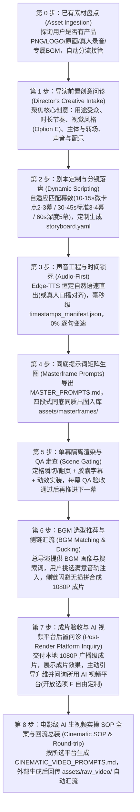

# human-ai-video-director：人机协同 AI 短视频工业化制作工坊

这是一个专为 **“用户外部生成式 AI 武器库 + Agent 本地确定性工程工具”** 打造的工业级短视频全流程制作 Skill。

不再陷入“纯代码硬搓假人立牌的塑料生硬感”或“纯大模型生视频汉字乱码形变”的两难困境，而是将两者优势在毫秒级时间轴上完美咬合：
- **生成式 AI（Grok / Midjourney / Gemini）负责“印刷级质感与生动神态”（灵魂）**；
- **确定性工程（studio CLI / Edge-TTS / Remotion / HyperFrames / 剪映）负责“分秒不差的排版与交互”（骨骼）**。

---

## 🚀 一、 导演级 7 步人机协同工作流 (The 7-Step Director's Protocol)

当用户发起视频制作需求（如：*“我想做个宣传片”*、*“帮我把这个产品做成视频”*）时，Agent **必须严格扮演“专业 AI 视频总导演”角色**，禁止自作主张固定模板，禁止硬塞预设！必须按以下 7 步严谨推进：



---

### 步骤详情与总导演执行规约：

#### 🎬 第 0 步：已有素材盘点与自动接管 (User Asset Ingestion)
- **探询原则**：在提问一开始，主动探询用户手头是否有现成素材：
  - **产品透明底 PNG / LOGO**：放入 `assets/user_assets/`（作为大模型生图垫图或引擎直接排版贴图）；
  - **已有成套画卷 / 海报**：放入 `assets/masterframes/`（**直接跳过第 4 步 AI 生图**，免去重绘成本）；
  - **真人口播录音**：放入 `assets/audio/`（跳过 Edge-TTS，由真实波形驱动时间戳）；
  - **专属 BGM 音轨**：放入 `assets/bgm/`（跳过 BGM 推荐，直接应用动态侧链避让混音）。

#### 📋 第 1 步：导演前置创意问诊交互表单 (Director's Creative Intake)
当用户触发创作需求时，Agent 应聚焦于**剧本视听创意与工具箱能力调用**，主动抛出 6 个维度的问诊引导：
1. **【用途与受众】**：
   - A. 电商带货种草（重颜值、强氛围、高转化）
   - B. 软件产品功能官宣 / 极客演示（硬核、逻辑清晰、凸显破局解法）
   - C. 知识干货 / 行业认知拆解（干货提炼、权威诊断、通关升华）
   - D. 自由输入你的具体业务场景与受众人群
2. **【时长与幕数节奏】**：
   - A. 10s ~ 15s 极速微短片 / 爆款卡点（2 ~ 3 幕）
   - B. 30s ~ 45s 中短视频 / 功能拆解（3 ~ 4 幕）
   - C. 50s ~ 65s 深度干货 / 标杆大片（黄金 5 幕）
   - D. 自由指定特定时长与幕数
3. **【视觉风格与美学调性】**：
   - A. 现代科技 SaaS 风 (`modern_tech`，深空蓝黑底、霓虹蓝、半透明玻璃拟态胶囊字幕)
   - B. 经典杂志手账折页风 (`journal_scrapbook`，暖米白纸底、书脊折痕、思源粗黑排版、荧光笔)
   - C. 3D 萌系黏土桌宠风（超高亲和力、微距景深、暖光摄影）
   - D. 极简黑白商务高级风
   - **E. 自由定制风格（用户输入）**：如赛博朋克、复古胶片、日系极简暖阳、手绘插画涂鸦等
4. **【转场方式与画面主体】**：
   - **转场**：A. 纯硬切 Jump Cut（现代爆款主流） / B. 2.5D 物理折痕翻书 / **C. 自由定制转场**（快门闪白、推焦冲屏等）
   - **主体**：A. 纯产品特写静物 / B. 真人出镜（肖像锁定） / C. 3D 卡通萌宠 / **D. 自由定制主体**（3D 爆炸拆解、悬浮 UI 视差等）
5. **【声音与音乐偏好】**：
   - 阳光活力青年男声 (`Yunxi`) / 沉稳专业专家男声 (`Yunjian`) / 温暖知性女声 (`Xiaoxiao`) / 自由指定
   - 期望的 BGM 风格（轻松俏皮 Pop / 科技律动 Future Bass / 治愈暖调 Lo-Fi / 自由指定）
6. **【军火库生态与伴生 Skill 参考】(Video Arsenal & Companion Skills - 可选，默认 A)**：
   > *💡 备注：此项为可选进阶项（非必填）。若无特殊需求可直接跳过或选 A，工坊将默认采用原生标准工业管线；若希望融入特定视觉或动效（如白板手绘、代码拆解、火柴人或 3D WebGL），可在此勾选对应武器。*
   - **A. 默认标准工业流水线**（大模型同底画卷 + 定格瞬切/翻页 + 胶囊字幕 + 侧链混音）
   - **B. 暖白纸流墨手绘白板风**（参考/调用 `srt-whiteboard-animation`：仿真实体手绘涂鸦笔触）
   - **C. 黑底极简硬核科技代码风**（参考/调用 `anything2explainer`：图灵宇宙风格，高密参数与算法逻辑解构）
   - **D. 157+ 镜头配方卡与 2.5D 动效**（参考/调用 `video-shotcraft`：Remotion 视觉动效全家桶与多机位转场）
   - **E. 幽默剧情火柴人**（参考/调用 `stickman-video-director`：低成本高幽默故事演绎）
   - **F. Q 版蜡笔手绘生活指南**（参考/调用 `hand-drawn-video-prompts`：温馨亲和生活职场分镜）
   - **G. 真人口播 + 智能画中画弹窗**（参考/调用 `cut-director`：真人出镜切气口 + 产品悬浮 UI）
   - **H. WebGL 3D 悬浮与代码动效**（参考/调用 `HyperFrames`：手机 360° 旋转、3D 爆炸悬浮、复杂网页交互）
   - **I. 自由指定或跨模态融合（用户输入）**

#### 📝 第 2 步：剧本定制与分镜落盘 (Dynamic Scripting & Storyboard Setup)
- **导演动作**：根据问诊结果定制对白台词、动作姿态与动态 FX（每句建议 10~22 字，留足气口）；
- **动作密度与同机位连环画铁律 (Action Density & Stop-Motion Discipline)**：
  - **最低动作密度底线**：凡单幕时长 $\ge 2.5$ 秒，**必须规划至少 2~3 个连贯微动作姿态**（每个微动作时长控制在 $1.2\text{s} \sim 1.8\text{s}$，严禁单张静态死图硬撑 3 秒以上）；
  - **同机位三脚架锁死 (Locked Rigid Tripod)**：同一幕内的所有姿态，**必须保持 100% 同一三脚架机位、同一背景环境、同一角色屏幕坐标 (x, y)**；
  - **纯增量姿态演进 (Delta Pose Shift)**：姿态描述只能是微表情或微肢体动作（如：`正面微笑` ➔ `歪头眨眼` ➔ `轻微抬手`），**严禁在同一幕内随意更换背景道具、换键盘或突跳全景/特写**！
- **呈递方案与严格拍板门禁 (Proposal Gate - 用户明确确认前严禁抢跑)**：
  - 向用户清晰呈递策划方案与分镜剧本，**必须在此停步等待，严禁擅自偷跑执行**；
  - **红线底线：在用户没有明确肯定答复、正式拍板确认开始执行（如明确回复“开始”、“执行”、“确认方案”、“选方案A”等）之前，绝对不允许执行方案生成视频，严禁调用任何引擎命令（包括 `init`、`audio`、`render`、`assemble`）或直接生成媒体资产**；
  - 只有在收到用户明确的拍板确认指令后，方可执行 `python -m studio init <project_name>` 并写入 `storyboard.yaml` 启动下游管线。

#### 🎙️ 第 3 步：声音工程与时间锁死 (Audio-First Engineering)
- **执行命令**：`python -m studio audio build --project <project_name>`；
- **技术要点**：统一自然恒定语速直出（`rate=+18% ~ +20%`），输出全片唯一真理源 `timestamps_manifest.json`；**严禁逐句强行变速**。

#### 🎨 第 4 步：同底提示词矩阵生图 (Masterframe Prompts Generation)
- **执行命令**：`python -m studio prompt generate --project <project_name>`；
- **交付内容**：输出 `MASTER_PROMPTS.md`，包含三脚架绝对锁死指令与局部增量重绘指南（Midjourney Vary Region / Grok 低降噪），用户快速出图存入 `assets/masterframes/`。

#### 🎬 第 5 步：单幕隔离渲染与 QA 走查 (Scene Gating & Anchoring)
- **执行命令**：`python -m studio render --project <project_name> --scene 1`（或全量渲染 `--all`）；
- **技术要点**：
  - **定格动能回弹 (Stop-Motion Bounce)**：引擎在每个姿态跳切瞬间自动施加 0.16s 物理微弹冲（Scale Punch 1.024x），彻底消除 PPT 死图感；
  - **无缝镜头推进**：单通道合并 Ken Burns 微距平滑缓推，保持亚像素画质锐利；
  - **自适应胶囊字幕**：居中动态渲染，自动提取 QA 关键帧走查。

#### 🎚️ 第 6 步：BGM 选型推荐与动态侧链汇流 (BGM Matching & Ducking Assembly)
- **导演动作**：提供专业 BGM 选型画像（风格、BPM 节拍、检索词），引导用户挑选后存入 `assets/bgm/`；
- **执行命令**：`python -m studio assemble --project <project_name>`；
- **技术要点**：无损拼接 + 动态侧链闪避（人声 12%，气口 25%），交付广播级 1080P 成品 MP4。

#### 🚀 第 7 步：成片验收与 AI 视频平台后置问诊 (Post-Render Handover & Platform Inquiry)
- **导演动作**：
  1. 向用户展示刚刚生成的 1080P 本地成片（具备毫秒级精确对齐的字幕与侧链混音）；
  2. 主动告知用户：“当前定格短片已完成！如果希望将画面升级为具有电影级推拉摇移、微距光影流动的大片，我们现在可以开启【电影级 AI 运镜与生视频升维】”；
  3. 发起**目标 AI 视频平台问询（包含选项 F 自由定制）**：
     - **A. 快手可灵 AI (Kling 3.0 / 1.5)**（推荐 5s/10s，首尾帧过渡模式，开启运镜控制/运动笔刷）
     - **B. Runway Gen-3 (Alpha / Turbo)**（推荐 5s，Camera Control 六轴运镜滑块与首尾帧过渡）
     - **C. Luma Dream Machine**（推荐 5s，自然语言运镜控制，支持 Extend 延长）
     - **D. 海螺 AI (Minimax) / 智谱清影**（推荐 6s，高物理动态）
     - **E. 字节即梦 (Jimeng)**（推荐 3s/5s，中文首尾帧插值）
     - **F. 自由选择其他平台（用户输入）**（如 Sora, Pika, 腾讯混元等，Agent 实时根据该平台特性与限制量身定制运镜与首尾帧规则）
     - **G. 保持当前本地定格成片，无需生成**

#### 🎥 第 8 步：电影级 AI 生视频实操 SOP 全案与回流总装 (Cinematic SOP & Round-trip Assembly)
- **交付内容**：根据用户选择的平台生成针对性极强的 `CINEMATIC_VIDEO_PROMPTS.md`：
  - **长视频拆解与 5s 窗口匹配**：全片自动切片为 3~5 秒独立微镜头，天然吻合各平台 5s 生成限制；
  - **首尾帧无缝接力 (First-End Frame Relay)**：明确每个分镜的【首帧上传路径】与【尾帧接力路径】（末帧锚点/下一幕首图），彻底解决镜头断崖变脸；
  - **平台参数面板与运镜滑块指南**：运动幅度锁定在 `3~4`（防画面融化）；
  - **外部视频本地自动汇流总装**：指导用户将生成的视频片段存入 `assets/raw_video/`，本地执行 `python -m studio assemble` 即可自动由 AIConformer 完成 1080×1920/30fps 统一转码对齐，自适应延展末帧保证人声绝不被截断，并施加**动态侧链避让混音**！

---

## ⚡ 二、 HyperFrames 代码动效引擎安装与集成指南

当项目中需要复杂的 WebGL、GSAP 复杂镜头动效、3D 手机壳悬浮翻转或前端交互录屏时，强烈推荐使用 **HyperFrames**：

### 1. 下载与安装方式 (Installation)
HyperFrames 基于 Node.js / Web 渲染生态，安装方式如下：

```bash
# 全局安装 HyperFrames CLI 工具链
npm install -g hyperframes

# 或者使用 npx 免安装即时运行
npx hyperframes --version
```

### 2. 常用开发与质检命令 (CLI Commands)
```bash
# 1. 语法与 Schema 严密校验 (确保所有时间轴标签、媒体引用合规)
npx hyperframes check ./my_hyperframes_project

# 2. 本地实时交互式时间轴预览
npx hyperframes preview ./my_hyperframes_project

# 3. 极速提取关键帧画卷走查 (Contact Sheet)
npx hyperframes snapshot ./my_hyperframes_project -o ./qa_frames.jpg

# 4. 智能一键去背抠图 (提取高精度纸片人切片)
npx hyperframes remove-background input.png -o output_clean.png

# 5. 无头浏览器高保真 60fps 渲染导出
npx hyperframes render ./my_hyperframes_project -o ./output/video.mp4
```

---

## 🧰 三、 视频制作工具箱生态矩阵 (`video_tools_ecosystem/`)

本项目内置了完整的周边视频创作工具箱生态，位于 `video_tools_ecosystem/` 目录：

1. **`mcp_chatcut_desktop/`**：剪映 / CapCut 桌面端双向交互 MCP 协议中枢，内置 60 个原子工具 Schema 与操作指南。
2. **`companion_skills/`**：收录 8 大顶尖开源视频制作 Skills：
   - **`srt-whiteboard-animation`**（[geeklee](https://github.com/geeklee/srt-whiteboard-animation)）：暖白纸流墨手绘白板动画；
   - **`anything2explainer`**（[Vincentwei1021](https://github.com/Vincentwei1021/anything2explainer)）：黑底极简科技感讲解视频；
   - **`video-shotcraft`**（[Vincentwei1021](https://github.com/Vincentwei1021/video-shotcraft)）：157+ 镜头配方卡与 2.5D 动效分镜工坊；
   - **`stickman-video-director`**（[kaomei](https://github.com/kaomei/stickman-video-director)）：火柴人叙事视频导演；
   - **`hand-drawn-video-prompts`**（[kaomei](https://github.com/kaomei/hand-drawn-video-prompts)）：暖白底 Q 版蜡笔手绘 9:16 分镜；
   - **`cut-director`**：口播剪辑与智能画中画弹窗导演；
   - **`ffmpeg-video-editor`**：FFmpeg 原子剪辑与高保真转码工具；
   - **`yh-tools-video2srt`**：视频快速提取字幕与语音识别工具。

---

## 🛑 四、 七大不可逾越工程红线 (The 7 Non-Negotiables)

1. **【未经明确拍板绝不擅自执行方案生片 (Strict Pre-Execution Sign-Off Gate)】**：向用户呈递策划提案、分镜剧本或制作方案后，**在用户没有明确给出肯定答复、正式拍板确认执行（如明确回复“开始”、“执行”、“确认方案”、“选方案A”等）之前，绝对不允许执行方案生成视频**！严禁抢跑初始化项目配置、严禁合成音频、严禁调用生图或启动视频渲染总装，必须严格就地停步等待指令。
2. **【绝不擅自合并总片】**：单幕精调必须独立交付，经走查满意后方可推进下一幕。
3. **【绝不逐句强行变速】**：严禁滥用 `atempo` 橡皮筋拉伸单句，声音自然流淌，画面适配声音。
4. **【绝不切文字区做羽化】**：严禁在带有文字、卡片的区域做代码 Alpha 羽化拼合，100% 同底整页直出。
5. **【坚守同机位定格与动作密度】**：严禁单张死图硬撑 3 秒以上（单幕 $\ge 2.5$ 秒强制 $1.2\text{s} \sim 1.8\text{s}$ 微姿态递进）；严禁同一幕内随意换机位与背景穿帮，必须锁死三脚架；跳切瞬间施加 0.16s 物理微弹冲（Scale Punch），坚守生动定格质感。
6. **【字音毫秒同源绝对对应】**：字幕文本与配音文本单一数据源，字幕区间由配音实际波形起止点驱动。
7. **【必须输出 QA 关键帧走查】**：自动抽取动作切换点与转场帧，肉眼复核文字锐度后方可汇报交付。
