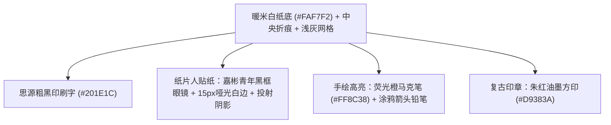

# 《好帮手AI话术私教》视频制作标准化SOP与执行全案 (Master Production SOP)

> [!IMPORTANT]
> **本文档定位**：
> 本 SOP 是整个项目的**终极生产标准与交接手册**。新开启的对话框无需回顾过往历史对话，**只需阅读本文档即可 100% 无损继承全部审美标准、踩坑教训、核心生产方法论与分幕资产**，即刻无缝推进制作。
>
> **终版声线与合规台词**：成片与开源模板为 `zh-CN-YunxiNeural`。第四幕禁止「800元续保补贴」，改为「数据支撑 / 90%同到期车主已办理」。分幕过程记录里若仍出现 Yunjian，以 `examples/01_sales_coach_template/storyboard.yaml` 为准。

---

## 一、 项目概况与基础规格 (Executive Specs)

- **项目名称**：《好帮手AI学习助手 · 话术私教》业务功能推广视频
- **输出规格**：
  - 分辨率：`1080 × 1920` (9:16 竖版，满屏沉浸式)
  - 帧率：`30.0 fps`，视频编码 `H.264 (libx264, yuv420p)`，音频编码 `AAC (44.1kHz, mono)`
- **全片节奏与时长哲学**：
  - **摒弃注水凑时长**：彻底抛弃“必须凑满90秒”的陈旧观念，各幕时长由内容密度自然决定，单幕约 10~12 秒，全片紧凑控制在约 55~65 秒；
  - **高留存铁律**：任何静态画面或单人物姿态**停留绝对严禁超过 3.5 秒**；
- **声音系统**：
  - 单人口播旁白。终版成片与开源模板统一 **`zh-CN-YunxiNeural`**（阳光青年）；需要更强张力时可改用 `zh-CN-YunjianNeural`。禁止销售与客户对答的多角色机器感。
  - 语速：仅在 TTS 引擎层设置恒定 `rate=+18%~+20%`。**严禁逐句 `atempo`。**

---

## 二、 核心美学规范：方案2【杂志折页手账风 · 纸片人定格拼贴】



| 视觉元素 | 规范标准 | 实现要求 |
| :--- | :--- | :--- |
| **纸张背景** | `#FAF7F2` 温润糙面纸纹 | 居中竖向折痕阴影、轻微网格标尺、左下角斜放银色自动铅笔 |
| **主标题字** | 思源黑体 Heavy / 现代粗黑体 | 位于上 1/5 区域，高对比印刷墨黑，带手绘下划线或重点标记 |
| **主讲人嘉彬** | 青年、黑框眼镜、黑色短袖T恤 | **纸片人风格**：轮廓带 ~15px 剪纸白边，带柔和自然投射阴影 |
| **卡片与便利贴** | 圆角纸卡、红顶通知条 | 模拟真实纸张便签撕贴质感，带阴影层次 |
| **辅助图形** | 手绘铅笔箭头、波浪乱线、疑问涂鸦 | 增加手账真实感与视觉引导性 |

---

## 三、 黄金方法论突破：大模型同底同质直出 (Model Native In-Context Conditioning)

在前期探索中，我们踩过了关键坑，最终锁定了能够**稳定工业化输出顶级质感**的核心解法：

### ❌ 已废弃的歧路 (Lessons Learned & Anti-Patterns)
> 详见项目根目录规约：[`LESSONS_LEARNED_AND_RED_LINES.md`](file:///d:/video/视频3/LESSONS_LEARNED_AND_RED_LINES.md)
1. **纯代码 PIL 几何硬拼**：用代码画矩形卡片、贴系统字体。效果塑料生硬、缺乏纸张触感，被用户明确否决（“像程序员拼出来的UI，割裂感极重”）；
2. **生硬扣图拼贴**：抠出人物强行贴在白底上，人物与背景的光影、边缘和网格完全脱节；
3. **文字区代码切片羽化缝合（重大失误）**：试图对大模型画卷的文字/便签卡片区进行 Alpha 渐变羽化缝合，导致文字纵向切断、错位与半透明重影。**铁律：绝不在文字/卡片密集区做羽化拼合，100% 采用同底原生母版直出**；
4. **逐句 atempo 强行变速（听感灾难）**：为了机械迎合画面分段时长，对单句音频施加不同倍率拉伸，导致“语速忽快忽慢”。**铁律：全局恒定自然语速直出，声音驱动画面停顿**；
5. **代码平滑正弦微晃（美学偏差）**：用代码正弦角度摆动人物贴纸，产生塑料眩晕感。**铁律：全片彻底去除一切人物代码平滑微晃，坚守纯正手账实体定格抽帧瞬切**。

### ✅ 经过实机验证的黄金解法 (Verified Golden Workflow)
利用大模型（`generate_image`）的多图上下文理解能力，进行 **“同底同质直出”**：
1. **输入 Reference Image 1（主布局底板）**：提供已确立的整页杂志画卷；
2. **输入 Reference Image 2（人物姿态参考）**：提供对应情绪动作的真人照片或贴纸；
3. **提示词强约束（Prompt Locking）**：
   - 锁定背景纸质、中央折痕、网格线；
   - 锁定顶部英文章节号、主标题中文排版、便利贴红顶文字、底部自动铅笔与手绘箭头；
   - **仅置换人物动作、眼神与神态**，并要求保留白边纸片人剪纸轮廓；
4. **效果收益**：
   - 字体与版式 100% 像素级对齐，未出现乱码；
   - 人物白边剪影与环境投影完全由模型原生渲染，拥有 100% 杂志印刷级的一体化光影质感；
   - 产出的同底多姿态画卷，可无缝用于**定格动画抽帧瞬切**。

---

## 四、 剪辑与动态微动效法则 (Motion & Animation Standards)

| 动效类型 | 典型场景 | 实现机制与参数 |
| :--- | :--- | :--- |
| **定格抽帧瞬切 (Stop-Motion Jump Cut)** | 人物姿态/情绪切换 | 基于同底直出画卷，背景文字不动，人物在指定重拍节奏点（如 2.5s）瞬间瞬切动作，复现高质感手账定格动画 |
| **微动作定格连环 (Stop-Motion Pose Alternation)** | 同场景人物微动作生命感 | **核心铁律**：凡出镜场景同底直出 2~3 张微动作连续画卷（如挠头侧面 ↔ 挠后脑勺；食指平指 ↔ 挑指点头），在节奏点以 0.5s~1.0s 抽帧交替循环，打造真正活过来的纸片人定格动画 |
| **严禁人物正弦微晃 (No Pseudo-Wiggle)** | 全片所有人物在场时段 | **终极红线**：彻底去除一切人物代码级正弦微摆（Wiggle）与骨骼平滑扭动，避免塑料眩晕感，全片 100% 回归纯正手账实体定格抽帧瞬切！ |
| **大画面杂志翻页 (Magazine Page Flip Physics)** | Scene 01A→01B 及各幕转场 | **核心铁律**：大场景/大版面切换严禁生硬平移，统一采用手账折页/翻书动画（右侧页边卷起、中心折痕背光阴影移动、翻出下一页），叠合翻书 Whoosh 音效 |
| **局部高频微晃 (Micro Wiggle)** | 红色挂断按钮 | 伴随挂断忙音，以自身中心做 `sin(t * 22) * 8°` 衰减振颤，表达被拒接的突发冲突 |
| **纸张撕落抛飞 (Paper Peel Physics)** | 第一幕便利贴撕除退场 | 沿逆时针抛物线加速度旋转 (`-25°`) 飞出屏幕，叠合清脆撕纸 Whoosh 音效 |
| **人物入场/退场 (Paper Slide & Jump Cut)** | 人物登场与转场 | 入场：右侧 `X=1200` 缓动滑入至 `X=450` 定格；退场：定格切出或平移出屏幕 |
| **镜头微距呼吸 (Slow Push-in)** | 痛点或重点强调 | 画面从 `1.00x` 缓慢推向 `1.05x`，或二次微距聚焦于重点高亮文字行 |
| **现代居中字幕 (Floating Capsule Subtitles)**| 全片台词同步 | 采用 `#201E1CE6` 暖黑半透圆角胶囊底板 + 纯白思源黑体，单行简短居中，毫秒级音字同步 |

---

## 五、 全片 5 幕执行总表与剧本台词 (Master Storyboard & Script)

### 第 1 幕：痛点觉醒 · 秒挂与异议危机 (已完成交付 V3 终版成片)
- **时长**：**12.00 秒** (严格 360 帧，30fps)
- **成片路径**：`d:\video\视频3\output\video\scene_01_animated_v3.mp4`
- **台词配音** (zh-CN-YunjianNeural 原生恒定语速直出，0% atempo)：
  > “刚开口，就被客户秒挂！面对客户的‘现在忙、不需要’，大脑一片空白不知如何回复。新人缺乏异议经验，根本留不住客户，导致开单率怎么也上不去。”
- **动效落地**：
  1. `0.00s~2.25s (0~68帧)`：嘉彬手持电话专注沟通（01A 姿态1），卡片红色通知条平整锐利；
  2. `2.25s~3.60s (68~108帧)`：挂断忙音响起，伴随 6 帧微幅轻颤，定格瞬切为愁眉苦脸看手机（01A 姿态2）；
  3. `3.60s~4.93s (108~148帧)`：定格瞬切为捏鼻梁揉眉心发愁（01A 姿态3）；
  4. `4.93s~6.00s (148~180帧)`：定格瞬切为扶额叹气呼白烟（01A 姿态4）；
  5. `6.00s~6.60s (180~198帧)`：定格瞬切为痛苦闭眼双手护胸（01A 姿态5，情绪推至顶点）；
  6. `6.60s~7.30s (198~219帧)`：2.5D 手账折页物理翻书转场（Page Turn 卷边投影 + 翻书音效）无缝切入 01B；
  7. `7.30s~12.00s (219~360帧)`：01B 危机清单展开，嘉彬以精确 1.0 秒（每30帧）定格交替抓头发愁（抓侧面 ↔ 抓后脑勺），微距推镜高亮开单率痛点，现代圆角胶囊字幕音字完美同步。

---

### 第 2 幕：破局重塑 · 24关实战异议地图 (已完成交付 V2 精修成片)
- **时长**：**14.20 秒** (严格 426 帧，30fps)
- **成片路径**：`d:\video\视频3\output\video\scene_02_animated_v2.mp4`
- **主画卷**：
  - `素材/04_分幕原生画卷/Scene02A_破局共鸣_主管没空教.jpg`
  - `素材/04_分幕原生画卷/Scene02_破局重塑_24关地图_手托引导.jpg`
  - `素材/04_分幕原生画卷/Scene02_破局重塑_Pose4_食指点划.jpg`
  - `素材/04_分幕原生画卷/Scene02_破局重塑_Pose5_握拳打满.jpg`
- **台词配音** (zh-CN-YunjianNeural 恒定语速 rate=+15%, 0% atempo)：
  > “别担心，只是你练少了！主管忙、没空教？好帮手 AI 学习助手重磅上线——话术私教！从开场白、报价到促成，24 关实战异议地图，随时随地像打游戏一样刷满肌肉记忆。”
- **动效落地**：
  1. `0.0s~3.8s (0~114帧)`：Scene 02A 大画卷登场，展现“主管忙、没空教”现实痛点与破局共鸣；
  2. `3.8s~4.5s (114~135帧)`：2.5D 手账折页物理翻书转场，无缝翻入 24关实战异议地图；
  3. `4.5s~9.0s (135~270帧)`：嘉彬手托引导 ➔ 食指点划，荧光笔横扫划亮“开场白训练”与“促成”；
  4. `9.0s~14.2s (270~426帧)`：嘉彬自信握拳打满收尾，末帧输出为无缝衔接底板，居中圆角胶囊字幕毫秒级对齐。

---

### 第 3 幕：拟真对攻 · AI 对战与高压排雷 (已完成交付 V2 精修成片)
- **时长**：**13.80 秒** (严格 414 帧，30fps)
- **成片路径**：`d:\video\视频3\output\video\scene_03_animated_v2.mp4`
- **主画卷**：
  - 起始翻页：`素材/04_分幕原生画卷/Scene02_结尾最后一帧.png` (第二幕真实末帧 100% 像素级无缝衔接)
  - `素材/04_分幕原生画卷/Scene03_拟真对攻_Pose1_食指指向.jpg`
  - `素材/04_分幕原生画卷/Scene03_拟真对攻_Pose2_扶眼镜吃惊.jpg`
  - `素材/04_分幕原生画卷/Scene03_拟真对攻_Pose3_双手抱胸自信.jpg`
- **台词配音** (zh-CN-YunjianNeural 原生恒定语速直出 rate=+20%, 0% atempo，保留 0.35s~0.4s 自然气口)：
  > “点击挑战，你的对手比真实客户更挑剔！AI 瞬间化身各种刁钻性格的客户，逼真模拟高压通话。在零风险的安全屋里，把所有怯场和大脑空白，在正式开单前全部排雷！”
- **动效落地**：
  1. `0.0s~0.7s (0~21帧)`：2.5D 手账折页物理翻书，真实承接 Scene 02 最后一帧握拳打满无缝折入；
  2. `0.5s~3.2s (15~96帧)`：Pose 1 食指平指，伴随麦克风光环脉冲动效（24~46帧）；
  3. `3.6s~7.4s (108~220帧)`：Pose 2 扶眼镜吃惊，面对刁钻性格客户模拟高压通话；
  4. `7.8s~13.8s (234~414帧)`：Pose 3 双手抱胸自信微笑，【★ 零风险实战安全屋 ★】与【★ 全部排雷 PASS ★】复古印章弹跳盖印；
  5. 全程 0 代码正弦伪晃，镜头微距平滑缓推 (1.000x -> 1.035x)，居中圆角胶囊字幕音字毫秒级同步。

---

### 第 4 幕：深度诊断 · 45分残暴体检与利益前置 (已完成交付 V2 精修成片)
- **时长**：**17.00 秒** (严格 510 帧，30fps)
- **成片路径**：`d:\video\视频3\output\video\scene_04_animated_v2.mp4`
- **主画卷**：
  - 起始翻页：`素材/04_分幕原生画卷/Scene03_结尾最后一帧.png` (承接第三幕末帧双手抱胸自信微笑，100% 像素级无缝翻页)
  - `素材/04_分幕原生画卷/Scene04_深度诊断_Pose1_耸肩错愕.jpg`
  - `素材/04_分幕原生画卷/Scene04_深度诊断_Pose2_托腮思考.jpg`
  - `素材/04_分幕原生画卷/Scene04_深度诊断_Pose3_OK自信.jpg`
- **台词配音** (zh-CN-YunjianNeural 原生恒定稳健语速 rate=+20%, 0% atempo，单句保留 0.3s~0.4s 自然气口)：
  > “一通练完，AI立刻输出深度体检单！第一次只有45分？别慌，它给的可不是泛泛的加油，而是指骨到肉的解法：开场白太冗长？直接教你‘数据支撑’——第一句话抛出‘90%同到期车主已办理’，一秒锁死客户注意力！”
- **动效落地**：
  1. `0.0s~0.7s (0~21帧)`：2.5D 手账折页物理翻书，真实承接 Scene 03 最后一帧双手抱胸自信图无缝折入；
  2. `0.7s~5.1s (21~152帧)`：Pose 1 耸肩错愕（面对 45 分的惊讶与无辜），3.55s 伴随 45 分印章重砸音效与轻微衰减屏幕震颤；
  3. `5.1s~12.2s (153~366帧)`：Pose 2 托腮思考，专注研读体检单上的改进建议与利益前置；
  4. `12.2s~17.0s (367~510帧)`：Pose 3 OK自信，胸前打出利落 OK 手势（👌），自信从容锁定客户注意力；
  5. 7 段科学细分现代圆角胶囊字幕（单句 9~22 字，安全宽度 380~820px），代码实装自适应降字号熔断，100% 杜绝截断与出界；
  6. 全程 0 代码正弦伪晃，微距平滑缓推 (1.000x -> 1.035x)。

---

### 第 5 幕：通关升华 · 再练一次与立即行动 (CTA) (已完成交付 V2 精修成片)
- **时长**：**11.00 秒** (严格 330 帧，30fps)
- **成片路径**：`d:\video\视频3\output\video\scene_05_animated_v2.mp4`
- **主画卷**：
  - 起始翻页：`素材/04_分幕原生画卷/Scene04_结尾最后一帧.png` (承接第四幕末帧OK手势自信图，100% 像素级无缝翻页)
  - `素材/04_分幕原生画卷/Scene05_通关升华_Pose1_握拳蓄力.jpg`
  - `素材/04_分幕原生画卷/Scene05_通关升华_Pose2_开掌邀请.jpg`
  - `素材/04_分幕原生画卷/Scene05_通关升华_Pose3_点赞通关.jpg`
- **台词配音** (zh-CN-YunjianNeural 原生稳健播报 rate=+18%, 0% atempo，单句保留 0.25s~0.36s 气口)：
  > “哪里卡壳，就一键‘再练一次’，直到把金牌话术化作你的本能应变。现在就打开好帮手 APP，进入【话术私教】，开启你的销冠通关之旅吧！”
- **动效落地**：
  1. `0.0s~0.7s (0~21帧)`：2.5D 手账折页物理翻书，真实承接 Scene 04 最后一帧无缝折入；
  2. `0.7s~5.5s (21~165帧)`：Pose 1 握拳蓄力，展现刻意练习的拼搏意志；
  3. `5.5s~8.5s (165~255帧)`：Pose 2 开掌邀请，诚挚号召体验好帮手 APP，5.5s 伴随清脆解锁叮响 (*Ding SFX*)；
  4. `8.5s~11.0s (255~330帧)`：Pose 3 点赞通关，大拇指点赞 👍 与灿烂笑容，完满收官通关；
  5. 5 段精确分句现代圆角胶囊字幕，自动防溢出保护，微距平滑缓推 (1.000x -> 1.035x)。

---

### 🏆 终极总成片：全片大合流 (Master Film Assembly)
- **总时长**：**57.50 秒** (严格锁定黄金完播区间)
- **成片路径**：`d:\video\视频3\output\video\好帮手AI话术私教_终极宣传大片_1080P.mp4`
- **总文件大小**：**21.98 MB**
- **全片规格**：1080x1920 (9:16 竖版), 30fps, libx264 (CRF 18, yuv420p) + AAC 44.1kHz (320kbps)
- **QA 验收总包**：`output/qa_frames/master_film/` (qa_scene_01.jpg ~ qa_scene_05.jpg)

---

## 六、 素材目录快速索引 (Asset Quick Reference)

| 目录 | 核心内容 | 使用场景 |
| :--- | :--- | :--- |
| `素材/01_真人底图库/` | 嘉彬全身、正面、三视图、点赞原照 | 姿态参考与 Conditioning |
| `素材/02_透明纸片人贴纸/` | 带白边的透明人物贴纸（动作0~4、打电话、愁眉苦脸） | 分层动画与位移动效 |
| `素材/03_业务界面与UI/` | App 界面原图（地图、对练、45分诊断单、Logo） | 真实业务功能展示 |
| `素材/04_分幕原生画卷/` | 大模型直出的 1080x1920 杂志页（Scene01A, 01B, 02, 04）| 各幕主画面与抽帧切换 |
| `素材/05_分层动画切片/` | 红钮、独立便利贴、45分印章、手账底板 | 独立旋转、抖动、飞出道具 |
| `素材/06_音效与音频资产/` | 挂断忙音、撕纸声、持续蜂鸣等无损采样 | 与物理动效毫秒对齐 |
| `output/video/` | 成片存放处（含已交付的 `scene_01_animated_v2.mp4`） | 阶段成片与总成片 |
| `scripts/` | 自动化渲染脚本（如 `render_scene_01_v2.py`） | Python/FFmpeg 渲染逻辑 |

---

## 七、 新对话框一键交接启动指令 (Kickoff Prompt for Next Session)

> [!TIP]
> 打开新对话框后，直接将以下整段提示词复制发送给新 Agent 即可：

```markdown
你好！我们正在制作《好帮手AI学习助手 · 话术私教》的高品质竖版宣传视频（1080x1920, 30fps）。
本项目已确立【方案2：杂志折页手账风 · 纸片人定格拼贴】美学风格与【大模型同底同质直出 + 定格抽帧瞬切 + 局部物理微动效】的标准化生产管线。

项目工作区位于：d:\video\视频3
请先仔细阅读项目根目录下的两个核心规范文件：
1. `d:\video\视频3\AI_VIDEO_PRODUCTION_SOP.md`（完整生产SOP、各幕剧本分镜与动效铁律）
2. `d:\video\视频3\素材\README.md`（已整理就绪的6大资产分类目录索引）

目前状态：
- 第一幕（秒挂痛点，11.48秒）已完成全流程渲染交付（见 `output/video/scene_01_animated_v2.mp4`）；
- 接下来请直接为我推进【第二幕：破局重塑 · 24关实战异议地图（时长约 12 秒）】的制作。
请阅读完毕后向我汇报你掌握的关键制作原则，并给出第二幕的执行计划！
```
