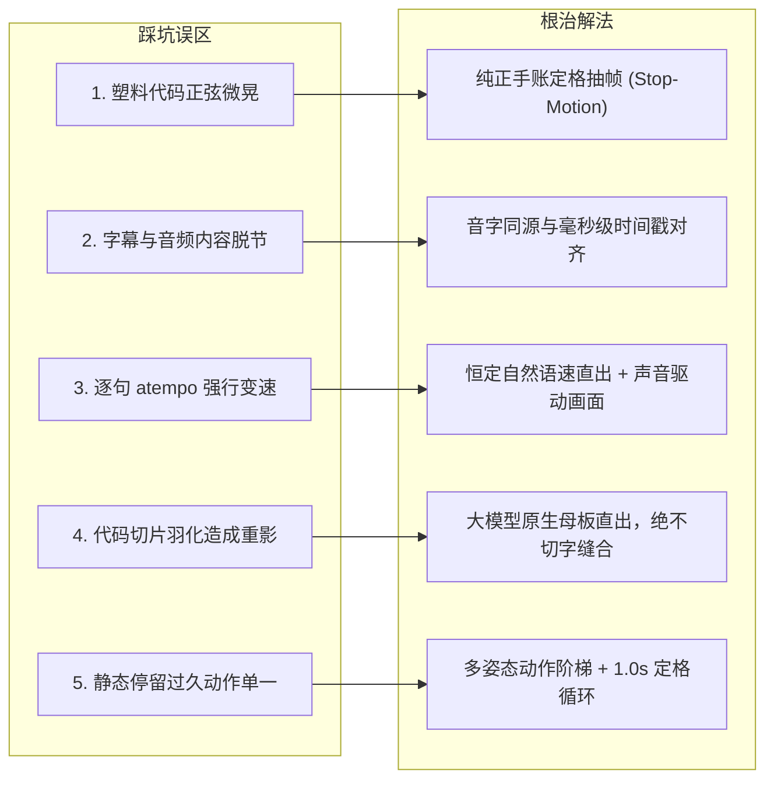

# 《好帮手AI视频项目 · 第一幕深度复盘与终极红线规范》
## (Post-Mortem, Root Causes & Engineering Red Lines)

> [!IMPORTANT]
> **红线效力**：
> 本规范基于第一幕（Scene 01）制作与精修过程中经历的全部反复、走过的弯路、用户指出的核心痛点总结而成。
> **在后续第二幕（Scene 02）至第五幕（Scene 05）的制作中，本规范具备最高优先级的约束力，所有代理与脚本严禁再次触犯！**

---

## 一、 第一幕出现的 5 大核心问题与错误反思 (Post-Mortem & Mistakes)



---

### ❌ 错误 1：滥用“代码正弦微动效（Wiggle）”产生塑料廉价感
- **犯错现象**：
  在尝试为角色增加微动作时，盲目使用代码给人物贴纸施加正弦角平滑摆动（`sin(t * w) * angle`），导致人物像 Flash 动画里的纸片一样在画面中机械扭动。
- **用户反馈**：
  *“人物的动效不加了去掉，效果很差。”*
- **根因剖析**：
  **美学理解偏差**。手账杂志风的真正灵魂是**实体纸质的“抽帧定格（Stop-Motion / Jump Cut）”**，讲究的是离散、利落的跳切质感，而非数字骨骼动画的平滑正弦晃动。强加代码摆动不仅破坏了画卷的高级感，反而带来严重的眩晕感和廉价感。
- **调整解决办法**：
  彻底废除并删除所有人物正弦摆动逻辑。回归纯正的定格动画——同底大模型多姿态瞬切（Jump Cut），每一帧人物都稳健落在纸面上，依靠动作切换产生生命力。

---

### ❌ 错误 2：字幕与音频脱节、台词内容与字幕不符
- **犯错现象**：
  在早期版本中，字幕显示时间轴与实际人声发音节点未严格同步，甚至一度出现字幕显示的文字与配音台词字眼不一致的问题。
- **用户反馈**：
  *“字幕和声音不匹配，字幕内容和音频内容也不匹配。”*
- **根因剖析**：
  **割裂开发，缺乏同源约束**。音频生成脚本（Edge-TTS）与视频渲染脚本（Render Script）各自维护了一套文本和时长配置，配音微调后，视频渲染脚本里的字幕区间没有动态对准，导致两张皮。
- **调整解决办法**：
  1. **台词与字幕完全同源**：在 Python 字典中定义单一数据源（Single Source of Truth），字幕显示文案与送入 TTS 引擎的文本 100% 逐字对应。
  2. **毫秒级时间戳硬标定**：提取 TTS 生成音频的真实波形起止点（精确到 0.01 秒），以毫秒级时间戳驱动字幕显隐。

---

### ❌ 错误 3：削足适履逐句强行变速（atempo）导致“语速忽快忽慢”
- **犯错现象**：
  为了机械迎合画面分段的预设时长（例如非要把第一句卡在 2.5 秒，第二句卡在 1.3 秒），使用 FFmpeg 的 `atempo` 滤镜对每一句配音切片施加不同倍率的拉伸或压缩（如第一句 1.25x，第二句 1.05x，第三句 1.35x）。
- **用户反馈**：
  *“现在对上了，但是语速忽快忽慢的，需要调整。”*
- **根因剖析**：
  **“画面绑架声音”的机械工程思维**。把声音当作可以随意橡皮筋拉伸的零件，破坏了播音员原生的语言节律、重音与呼吸顿挫，听感如同磁带卡带。
- **调整解决办法**：
  **确立【声音驱动画面 (Audio-Driven Animation)】核心原则**：
  1. 配音采用微软官方顶级音色 `zh-CN-YunjianNeural`，以全局恒定自然语速（`rate=+20%`，0% atempo 逐句变速）一次性完整直出，时长精确锁定 12.000 秒。
  2. 画面画面去适应声音的自然停顿，在人声天然的逗号、句号停顿点安排动作切帧与转场，听感丝滑流利。

---

### ❌ 错误 4：代码图层切割与羽化缝合导致“文字错位与半透明重影”（最严重事故）
- **犯错现象**：
  在引入用户上传的两张新姿态原画（揉眉心、扶额叹气）时，为了保留左侧便签卡片，脚本将左半边图层切出，并在 x 坐标 460~520 处使用渐变蒙版（seam_mask）进行 Alpha 羽化缝合。
- **用户反馈**：
  *“第一段的几张图片出现了这个文字错位 ，你看图片里的通话已被对方秒挂，秒挂这个位置出现了错位和重影，调整。”*
- **根因剖析**：
  红条卡片“通话已被对方秒挂”与白卡“我现在在忙，别打了！”的文字横跨 x=460~585。羽化遮罩正好从文字正中央切过！两张画卷中的文字位置存在微弱的几像素偏差，半透明融合后直接导致字体断裂、边缘重影。同时，大模型生成的同底画卷左侧卡片本身已经像素级对齐，多此一举的代码缝合纯属画蛇添足。
- **调整解决办法**：
  1. **彻底废除任何代码级图层切片与渐变羽化缝合**。
  2. **100% 原生母画卷直出 (Masterframe Native)**：直接将大模型生成的同底画卷作为背景层，卡片、红条、文字 100% 保持印刷级原画锐度，彻底根除重影与错位。

---

### ❌ 错误 5：单姿态停滞过久导致人物呆滞
- **犯错现象**：
  初期一个姿态在画面上静止超过 3.5 秒，角色缺乏灵动感，画面信息密度低。
- **用户指导**：
  *“多生成一些图片，丰富人物的动作，让人物动作更加连贯……第二段人物挠头可以1秒挠一次，也就是说挠头的图片可以一秒切一次，这样人物动作就很连贯舒服了。”*
- **调整解决办法**：
  1. **情绪阶梯五连定格**：在 01A 构建“专注通话 ➔ 愣住看手机 ➔ 揉眉心思考 ➔ 扶额深深叹气 ➔ 痛苦闭眼后仰”五连动作，情绪层层递进。
  2. **规律性定格循环**：在 01B 危机清单中，人物每隔精确 1.0 秒（30 帧）交替切换一次挠头动作（右手抓侧面 ↔ 右手抓后脑勺），既不喧宾夺主，又充满手账生命力。

---

## 二、 后续各幕（Scene 02 ~ 05）不可逾越的六大技术红线 (The 6 Non-Negotiable Red Lines)

为确保后面的每一幕精调一次性高品质过审，所有开发与渲染必须严格恪守以下六大红线：

| 序号 | 铁律红线 (Red Line) | 违反后果 (Severity) | 正确执行标准 (Standard Execution) |
| :---: | :--- | :---: | :--- |
| **红线 1** | **【绝不擅自合并总片】** | 严重失控 | **单幕精调必须独立交付！** 未经用户明确验收满意该幕成片之前，绝不触发 assemble_master_film.py 合并总片。 |
| **红线 2** | **【绝不逐句强行变速】** | 听感毁灭 | **严禁在单句上滥用 atempo 橡皮筋拉伸！** 全局统一使用 zh-CN-YunjianNeural 原生自然语速，声音自然流淌，画面适配声音。 |
| **红线 3** | **【绝不切文字区做羽化】** | 视觉事故 | **严禁在带有文字、卡片、高频细节的区域做代码 Alpha 羽化拼合！** 优先采用大模型同底整张原画；若需贴层，必须是带硬白边独立切片的贴纸。 |
| **红线 4** | **【绝不添加代码正弦微晃】** | 质感降级 | **严禁添加人物正弦摆动、骨骼扭动等平滑伪动效！** 人物动态仅允许采用【定格抽帧瞬切（Stop-motion Jump Cut）】。 |
| **红线 5** | **【字音毫秒同源绝对对应】** | 专业失范 | 字幕文案与 TTS 配音输入文本必须引用同一常量，字幕显隐区间必须由配音实际波形起止点驱动。 |
| **红线 6** | **【必须输出 QA 关键帧走查】** | 盲目交付 | 渲染脚本必须包含自动抽取关键帧逻辑（覆盖每个动作切换点、特效触发点），肉眼走查确认无重影无错位后方可汇报交付。 |

---

## 三、 标准化单幕生产与核验流水线 (Standard Operating Workflow)

后续制作 Scene 02 ~ 05 时，统一按以下 4 步标准化流程推进：

```
Step 1: 声音工程 (Audio Master)
  └─ 使用 scripts/build_scene_XX_audio.py
  └─ zh-CN-YunjianNeural 原生恒定语速直出，精确锁定秒数 (如 12.000s / 10.000s)
  └─ 导出精确毫秒级各句台词时间戳列表

Step 2: 资产锁定 (Asset Audit)
  └─ 检查同底大模型原生画卷，确保文字无乱码、卡片无割裂
  └─ 提取必要的分层动态切片（如印章、荧光笔刷等），必须是透明 PNG 硬切边缘

Step 3: 定格渲染 (Stop-Motion Render)
  └─ 依据 Step 1 的声音时间戳编排动作切换点（单动作不超 3.5s，定格循环 0.5s~1.0s）
  └─ 零代码平滑晃动，纯净背景 + 原生画卷定格瞬切
  └─ 居中现代圆角胶囊字幕，字音 100% 对应

Step 4: QA 抽帧走查 (Visual Verification)
  └─ 自动提取每个动作切片点帧图像至 output/qa_frames/scene_XX/
  └─ 重点放大检查文字区域、边缘有无重影错位
  └─ 独立成片交付用户审核，等待确认后再推进下一幕
```

---
*本文档已作为项目最高工程规范固化归档，后续分幕制作全员严格执行。*
