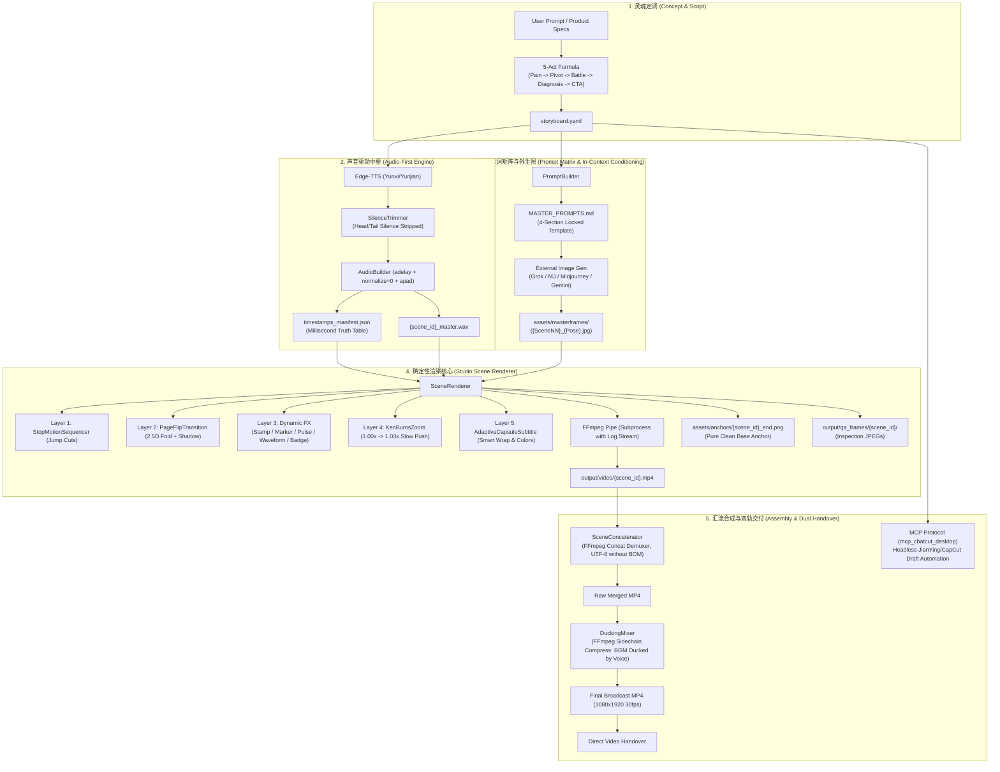

# 项目知识图谱与工程架构全景 (PROJECT_KNOWLEDGE_GRAPH)

> **版本**：v2.1 (Industrial Production Standard)  
> **更新时间**：2026-09-20  
> **定位**：人机协同 AI 短视频流水线架构图谱、底层规约、避坑机制与知识沉淀。

---

## 🗺️ 一、 系统全景拓扑图 (Architecture Topology)



---

## 🧩 二、 模块职责与接口映射 (Module Directory & Responsibilities)

| 模块目录 | 核心文件 | 核心职责 | 输入 / 输出契约 |
| :--- | :--- | :--- | :--- |
| **`studio/core/`** | `config.py` | 故事板解析与强类型配置封装；防御空 YAML/缺 ID | `storyboard.yaml` -> `StoryboardConfig` 对象 |
| | `manifest.py` | 毫秒级时间戳单真理源读写；分幕原子级落盘 | `manifest.json` <-> `TimestampManifest` 字典 |
| | `proc.py` | 跨平台子进程调用、FFmpeg 依赖探测与错误透传 | `run_command(cmd)` 统一捕获 UTF-8 stderr |
| **`studio/audio/`** | `tts_engine.py` | 微软神经语音异步合成；语速锁死与空字符校验 | 文本 -> 原始语音 MP3 |
| | `silence_trimmer.py` | 工业级静音剪切器；提取波形起止有效区间 | 原始语音 -> `trim.wav`，输出真实秒数 |
| | `audio_builder.py` | 轨道毫秒级延迟混音；`apad` 填充尾音，`normalize=0` 防衰减 | 多句 `trim.wav` -> `_master.wav` 与段落时间戳 |
| **`studio/prompt/`** | `prompt_builder.py` | 生成与出镜人解耦、与风格锁定的同底同质提示词矩阵 | 故事板 -> `MASTER_PROMPTS.md` |
| **`studio/engine/`** | `assets.py` | 健壮正则资产匹配（排除数字子串误判，合规版优先） | 搜索目录 + 姿态名 -> 本地图片路径 |
| | `stopmotion.py` | 毫秒定格时间轴时钟驱动；半开区间 `[start, end)` | 当前时间 $t$ -> 目标姿态 Pillow 图像 |
| | `transitions.py` | 2.5D 物理折痕翻书转场；双向阴影羽化与物理折线 | 上一幕底板 + 当前帧 -> 翻页合成帧 |
| | `camera.py` | 亚像素抗锯齿微距平滑呼吸缓推 (1.00x -> 1.03x) | 当前帧 + 进度 -> 缓推裁剪重采样帧 |
| | `subtitles.py` | 风格自适应双圆角胶囊字幕；智能标点折行与等比降号 | 画面 + 台词 + 颜色 -> 胶囊复合字幕帧 |
| | `renderer.py` | 5 层视觉管线总调度；FFmpeg 流水线写入与纯净锚点导出 | 姿态 + 音频 + 故事板 -> 单幕 MP4 与 QA 帧 |
| | `fx/` | `stamp.py`, `marker.py`, `pulse.py`, `waveform.py` 等动效 | 动效图层就地合成，支持分辨率比例变换 |
| **`studio/assembly/`** | `concatenator.py` | FFmpeg Concat Demuxer 无损直拼（严格 UTF-8 无 BOM） | 单幕 MP4 列表 -> 拼接 MP4 |
| | `ducking_mixer.py` | 标准广播级侧链压缩：人声主导触发，BGM 12%~25% 动态回弹 | 拼接 MP4 + BGM -> 最终交付 MP4 |
| **`studio/styles/`** | `base.py`, `journal_scrapbook.py`, `modern_tech.py` | 视觉色彩、字体、阴影、坐标自适应体系规范 | 风格预设名称 -> `StyleProfile` 单例配置 |

---

## 🛑 三、 六大不可逾越工程红线 (The 6 Non-Negotiables)

```text
┌────────────────────────────────────────────────────────────────────────┐
│                        ENGINEERING RED LINES                           │
├────────────────────────────────────────────────────────────────────────┤
│ 1. 【绝不擅自合并总片】: 单幕必须隔离渲染与 QA，人工复查通过方可总拼装。      │
│ 2. 【绝不逐句强行变速】: 严禁滥用 atempo 破坏声学波形，画面始终适配声音。      │
│ 3. 【绝不切文字区羽化】: 严禁在含字区域做 Alpha 渐变融合，必须整页同底直出。  │
│ 4. 【绝不加代码正弦伪晃】: 坚守实体手账跳切 (Jump Cut)，杜绝机械正弦漂移。    │
│ 5. 【字音毫秒同源绝对对应】: 字幕文本与配音时间轴单一真理源，严防字幕漂移。   │
│ 6. 【必须输出 QA 关键帧】: 动作切换点与转场点必须落盘，供肉眼复核验收。       │
└────────────────────────────────────────────────────────────────────────┘
```

---

## 🧠 四、 核心避坑指南与底层机制 (Battle-Tested Pitfalls & Hard-Won Knowledge)

### 1. FFmpeg Concat Demuxer 的 Windows 编码陷阱
- **致命陷阱**：在 Windows 上生成 `concat_list.txt` 时，若使用 Python 的 `utf-8-sig`（带 BOM 的 UTF-8），FFmpeg 在读取首行时会将 `\ufefffile` 解析为非法指令，报错：`unknown keyword '\ufefffile'`。
- **正解机制**：必须使用**无 BOM 的标准 `utf-8`** 写入列表，路径分隔符统一替换为正斜杠 `/`，并在路径包裹单引号，若路径中含单引号需转义为 `'\''`。

### 2. FFmpeg 侧链压缩（Sidechain Ducking）主次颠倒陷阱
- **致命陷阱**：`sidechaincompress=...` 的输入流顺序极其严格：`[被压缩流][触发检测流]sidechaincompress`。若写成 `[voice][bgm]sidechaincompress`，会导致人声在 BGM 播放时被压缩压低，产生严重的沉闷吞字。
- **正解机制**：
  ```ini
  [1:a]aresample=44100,volume=0.25[bgm];
  [0:a]aresample=44100[voice];
  [bgm][voice]sidechaincompress=threshold=0.05:ratio=8.33:attack=30:release=350[ducked];
  [voice][ducked]amix=inputs=2:dropout_transition=0:normalize=0,alimiter=limit=0.98[aout]
  ```
  人声必须走清晰干声，BGM 底音量置于 `idle_volume`，当人声讲话触发时压低至 `ducked_volume`。

### 3. `amix` 默认除以 $N$ 衰减与 `tail_pad` 假留白
- **致命陷阱 1**：FFmpeg 的 `amix` 默认开启 `normalize=1`。即使段落间通过 `adelay` 错开、互不重叠，FFmpeg 也会把整轨信号除以输入路数 $N$。4 句台词的幕会无端变轻 12dB。
- **致命陷阱 2**：FFmpeg 的 `-t` 选项只能截断流，**不能向后延长流**。若无音频信号，FFmpeg 会在最后一个音素瞬间截断，导致配置的 `tail_pad` 留白根本进不了 WAV 文件。
- **正解机制**：
  - 必须显式指定 `normalize=0`；
  - 混音链末尾必须挂载 `apad=pad_dur={tail_pad}`，确保留白时间物理进入音频流。

### 4. Windows 匿名管道 4KB 缓冲区死锁
- **致命陷阱**：在通过 `Popen(cmd, stdin=PIPE, stderr=PIPE)` 写入 1800 帧 RGBA 数据时，Windows 系统的匿名管道默认只有 4KB 缓冲。若 FFmpeg 输出的编码日志或警告超过 4KB，子进程将阻塞写 stderr，而父进程阻塞写 stdin，引发**永久死锁**。
- **正解机制**：将子进程的 `stderr` 直接绑定到真实磁盘日志文件句柄（`err_handle = open(..., "wb")`），Python 循环专注推帧，彻底隔绝死锁。

### 5. 翻页锚点（Anchor Frame）污染链
- **致命陷阱**：若直接将单幕渲染的最后一帧（包含 1.03x KenBurns 放大状态与当幕最后一句字幕）作为下一幕的翻页底板，会导致下一幕转场瞬间画面发生“尺寸跳缩”和“前幕字幕突兀残留”。
- **正解机制**：单幕渲染结束后，必须独立抓取未经 KenBurns 裁剪、未叠加字幕层的**纯净定格帧 + FX 动效帧**，单独存盘为 `assets/anchors/{scene_id}_end.png`。

---

## 🧰 五、 配套视频生态矩阵 (`video_tools_ecosystem`)

项目内置了 8 大周边短视频辅助技能与 1 个桌面剪映 MCP 服务：

```text
video_tools_ecosystem/
├── mcp_chatcut_desktop/        # 剪映 / CapCut 桌面端无头自动化 (60个原子工具Schema)
└── companion_skills/           # 8大顶尖开源视频微创新工坊
    ├── srt-whiteboard-animation/  # 暖白纸流墨手绘白板动画引擎 (geeklee)
    ├── anything2explainer/        # 现代极简科技黑底讲解视频 (Vincentwei1021)
    ├── video-shotcraft/           # 157+ 镜头配方卡与 2.5D 动效分镜工坊
    ├── stickman-video-director/   # 火柴人叙事与多机位导演 (kaomei)
    ├── hand-drawn-video-prompts/  # Q版蜡笔手绘 9:16 分镜生图提示词
    ├── cut-director/              # 智能口播画中画弹窗与自动跳剪
    ├── ffmpeg-video-editor/       # FFmpeg 原子级音视频处理脚本库
    └── yh-tools-video2srt/        # 高保真语音转字幕与对齐提取工具
```

---

## 🧪 六、 自动化质量门禁体系 (Testing & Verification Matrix)

```text
                     [ CI/CD & Local Smoke Pipeline ]
                                     │
         ┌───────────────────────────┴───────────────────────────┐
         ▼                                                       ▼
   【阶段 1~5: 冒烟测试】                                   【阶段 6: 契约测试】
(smoke_test.py ~2.6s)                               (test_pipeline_contracts.py ~0.4s)
- Phase 1: 依赖版本断言                               - test_pose_matching_scene_numbers
- Phase 2: 30个模块无环导入                           - test_ducking_filter_order
- Phase 3: 故事板 YAML 强校验                         - test_amix_and_tail_pad_filter
- Phase 4: 四段同底提示词直出                         - test_concat_list_utf8_and_quotes
- Phase 5: CLI 子命令 --help 契约                     - test_find_config_path_no_cwd_fallback
                                                      - test_yaml_none_and_missing_id
                                                      - test_style_unknown_and_subtitle_colors
                                                      - test_prompt_not_locked_to_black_tshirt
                                                      - test_manifest_storyboard_mismatch
                                                      - test_subtitle_fits_and_uses_style_color
                                                      - test_stopmotion_half_open_interval
                                                      - test_empty_tts_text
                                                      - test_missing_masterframe_raises
                                                      - test_one_frame_render_if_ffmpeg
```

---

## 📈 七、 历史演进里程碑 (Evolution Milestones)

- **阶段一 ~ 五**：确定 5 幕黄金剧本骨架，探索手账杂志折页风，解决文字羽化与人物正弦晃动问题。
- **阶段六 ~ 八**：完成微软云健/云希双声线录制，搭建 2.5D 物理翻书算法与胶囊自适应字幕。
- **阶段九 ~ 十一**：完成好帮手话术私教 1080P 成片交付，排除《保险法》116 条“800元补贴”违规文案，完成敏感隐私脱敏。
- **阶段十二**：模块化重构成通用 `studio` CLI 引擎，建立 `tests/smoke_test.py` 冒烟测试套件。
- **阶段十三**：响应 Grok 深度审查报告，全面重构 34 个核心文件，接入 7 类画卷动效，修正 BGM 侧链反向，补足 14 项契约测试。
- **阶段十四**：排雷 Windows Concat BOM 崩溃隐患，重导案例提示词，同步全局 `SKILL.md`，推送到 GitHub 远端开源仓库（Commit `d19d9bc`）。
