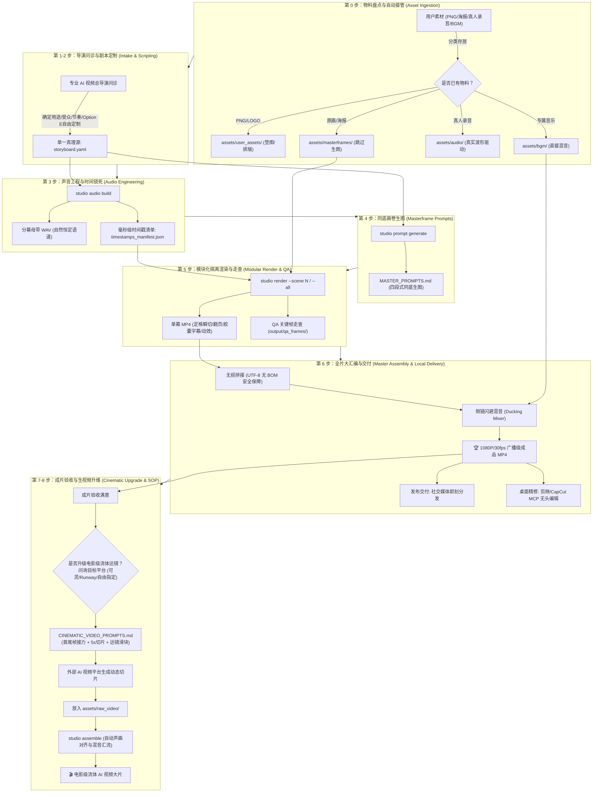
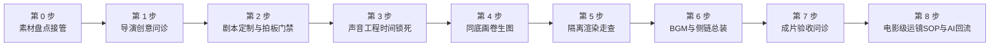
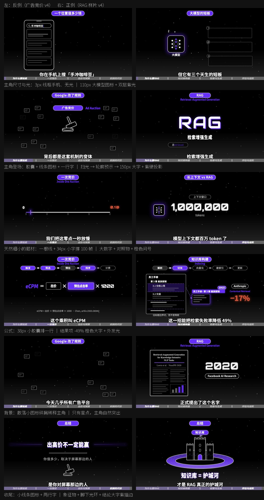
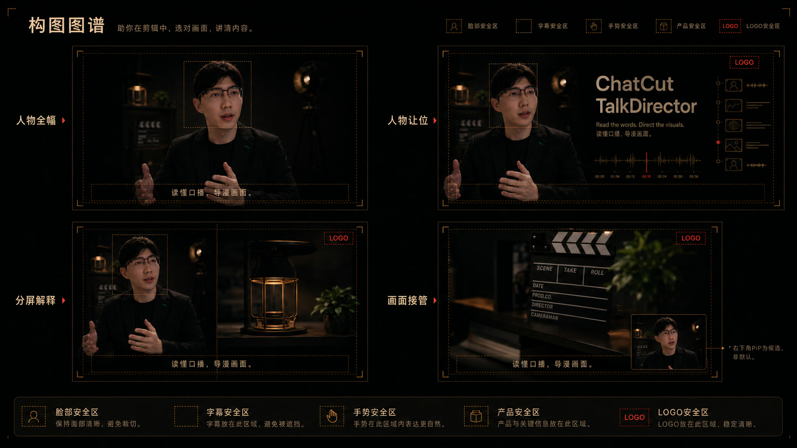

# 🎬 Human-AI Video Director (人机协同短视频工业化制作工坊)
### *From Concept & Assets to Broadcast-Grade 1080P MP4 and Cinematic AI Video Prompts in Minutes.*

[](https://www.python.org/)
[](https://opensource.org/licenses/MIT)
[](https://github.com/rany2/edge-tts)
[](https://ffmpeg.org/)
[](#-电影级-ai-运镜与生视频指令引擎-cinematic-directing-engine)
[](#-双轨交付与全套生态工具箱-dual-handover--ecosystem)

> 💡 **核心哲学：**  
> **“骨骼与节奏归确定性工程，灵魂与神态归生成式 AI。”**  
> *Deterministic Engineering for Timing & Layout, Generative AI for Aesthetics & Motion.*

告别纯代码硬搓假人立牌的生硬塑料感，告别纯大模型生视频的汉字乱码与界面形变。  
本项目将**大模型同底同质直出 (In-Context Conditioning)**、**参数化定格动画引擎 (studio CLI)**、**动态侧链混音**与**专业电影级生视频运镜指令**深度咬合，实现高完播率、印刷级质感与极高交付确定性的短视频工业化生产。

---

## ⚡ 为什么需要人机协同工坊？(The Paradigm Shift)

当前 AI 短视频制作的三大痛点与工坊破局之道：

| 生产维度 | 纯 AI 视频生成 (Pure Gen-Video) | 纯代码硬搓 (Remotion/代码拼贴) | 🌟 Human-AI Studio (本项目) |
| :--- | :--- | :--- | :--- |
| **汉字与版面** | ❌ 汉字乱码、品牌 LOGO 形变扭曲 | ✅ 排版清晰规整 | 🏆 **印刷级精准**：同底同质画卷锁死排版与文字 |
| **角色与主体** | ❌ 镜头切换时人物变脸、产品走样 | ❌ 假人立牌生硬，缺乏呼吸感与立体光影 | 🏆 **生动一致**：大模型锁定特征直出，3D/实拍质感拉满 |
| **运镜与动态** | ❌ 运镜随机不受控，多轴复合导致画面融化 | ❌ 仅能做简单平移缩放 | 🏆 **电影级运镜**：Camera First 工业级运镜指令直通外部平台 |
| **声音与节奏** | ❌ 音画脱节，语速忽快忽慢 | ⚠️ 依赖手动打点切片，门槛高耗时长 | 🏆 **声音即时间轴**：毫秒级时间戳单一真理源驱动全片 |
| **制作成本** | 💸 单条视频消耗昂贵算力，废片率 >70% | ⌛ 开发周期以天计算 | 🚀 **分钟级交付**：3 分钟同底生图，本地秒级渲染装配 |

---

## 🌟 五大核心工业化能力 (Core Superpowers)

### 1. 🎬 导演级自适应问诊与自由定制 (Adaptive Director Protocol)
- **拒绝死板套路**：彻底打破固定 5 幕限制，根据视频目标自适应匹配最佳节奏：
  - **10s ~ 15s 极速微短片 / 卡点爆款**：适配 **2 ~ 3 幕**（痛点唤醒 ➔ 核心亮相 ➔ 立即行动 CTA）；
  - **30s ~ 45s 中短视频 / 功能拆解**：适配 **3 ~ 4 幕**（痛点 ➔ 破局 ➔ 实操 ➔ 升华）；
  - **50s ~ 65s 深度干货 / 标杆大片**：适配 **黄金 5 幕**（痛点 ➔ 破局 ➔ 对决 ➔ 诊断 ➔ 升华）。
- **全要素自由定制与军火库生态融合**：
  - **美学自由定制（Option E）**：视觉风格除了现代科技 (`modern_tech`)、经典手账 (`journal_scrapbook`)、3D 黏土萌系风外，支持自由输入任意美学（如赛博朋克、复古胶片、日系极简暖色、手绘涂鸦等）；
  - **内置军火库能力融合**：前置问询是否联动生态军火库（手绘白板 `srt-whiteboard-animation`、极客代码讲解 `anything2explainer`、157+镜头配方 `video-shotcraft`、火柴人短剧 `stickman-video-director`、真人口播画中画 `cut-director`、或 3D WebGL 动效 `HyperFrames`）；
  - 转场支持纯硬切（Jump Cut）、2.5D 物理翻书或自由定制（快门闪白、推焦冲屏等）；
  - 画面主体支持静物特写、真人肖像、3D 吉祥物、爆炸拆解图或 UI 悬浮交互。

### 2. 📥 零摩擦已有素材自动接管 (Zero-Friction Asset Ingestion)
如果手头已有素材，流水线自动识别并无缝接管分流，免除二次重复生成：
- **产品透明底 PNG / 矢量 LOGO**：放入 `assets/user_assets/`（作为大模型生图垫图保持 100% 细节真实，或由引擎直接排版贴图）；
- **已有成套原画 / 实拍分镜海报**：放入 `assets/masterframes/`（**直接跳过第 4 步 AI 生图**，零重绘成本）；
- **真人口播录音 / 现成音频**：放入 `assets/audio/`（跳过 Edge-TTS，由真人真实声波时间戳驱动画面）；
- **专属定制 BGM**：放入 `assets/bgm/`（跳过 BGM 检索，直接对其施加侧链动态避让混音）。

### 3. 🎙️ 广播级声音工程与时间锁死 (Audio-First & Sidechain Ducking)
- **声音即时间轴（Audio-First）**：全片时长由配音波形起止点唯一决定，拒绝画面倒逼声音！
- **自然恒定语速（0% 逐句 atempo 强行变速）**：采用微软 Edge-TTS 神经网络音色（阳光青年男声 `Yunxi`、专家男声 `Yunjian`、知性女声 `Xiaoxiao`），以恒定自然速率直出，自动剥离头尾静音并补齐呼吸气口留白，产出全片单一真理源 `timestamps_manifest.json`；
- **动态侧链避让混音 (Sidechain Ducking)**：人声朗读时 BGM 自动平滑压低至 `12%`，停顿气口平滑回弹至 `25%`，人声干声清澈透亮，绝不喧宾夺主。

### 4. 🎥 电影级 AI 运镜与生视频实操 SOP 全案 (Cinematic Directing SOP & Multi-Shot Relay)
不仅提供提示词，更为外部大模型提供了一整套**图文强绑定、分镜头切片与首尾帧接力**的工业化落地全案（`CINEMATIC_VIDEO_PROMPTS.md`），全面适配**快手可灵 (Kling 3.0)、Runway Gen-3、Luma Dream Machine、海螺 AI (Minimax)、字节即梦 (Jimeng)**：
- **突破长视频生成限制 (Multi-Shot Chunking)**：针对主流平台单次只能生成 5s/10s 的硬件限制，工坊将全剧本按叙事节奏拆解为 3~5 秒独立微镜头切片，天然契合各平台 5s 生成窗口；
- **首尾帧无缝接力 (First-End Frame Relay)**：
  - **首帧 (First Frame)**：强绑定当前镜头母版原画（`assets/masterframes/SceneXX_pose_1.jpg`）；
  - **尾帧 (End Frame / 锚点)**：绑定末帧锚点（`assets/anchors/scene_XX_end.png`）或下一镜头首图，由平台推演两点间的自然物理形变与位移，**彻底根除镜头切换断崖与变脸**；
- **逐镜头实战任务卡 (Step-by-Step Production Cards)**：
  - 明确实操步骤：【1.首帧上传路径】➔【2.尾帧接力路径】➔【3.平台参数与运镜滑块建议】➔【4.一键复制专属指令】➔【5.回传保存路径】；
  - 严格恪守 **Camera First**（机位前置）、**One-Move Rule**（一镜一动）、运动幅度锁定在 `3~4`（防画面融化）；
- **外部视频本地自动汇流总装 (Round-trip Master Assembly)**：
  - 外部平台生成完成后，将视频放入 `assets/raw_video/`，本地执行 `python -m studio assemble` 即可自动由 `AIConformer` 完成 1080×1920 / 30fps 统一转码对齐，自适应延展末帧保证人声绝不被截断，并施加**动态侧链避让混音**！

### 5. 🧰 三轨交付与全套生态工具箱 (Tri-Handover & Ecosystem)
- **交付物 1（即刻发布）**：1080×1920 (9:16) / 30fps 广播级高清零水印成片 MP4；
- **交付物 2（桌面精修）**：借助内置 `mcp_chatcut_desktop` 协议，无头驱动剪映/CapCut 桌面端进行轨道微调与贴纸增补；
- **交付物 3（大模型运镜）**：开箱即用的生视频实战 SOP 全案，支持在外部 AI 视频平台一键生成生动大片并回流总装。

---

## 🏗️ 工业化全流程管线架构 (Pipeline Architecture)



---

## 🚀 导演级完整实战工作流程详解 (The Complete Human-AI Director Protocol)

当启动短视频创作时，工坊严格遵循**人机协同 8 步工业化规约**推进，既保持极简高效，又确保分秒不差的工程确定性：



---

### 🎬 第 0 步：已有素材盘点与零摩擦自动接管 (Zero-Friction Asset Ingestion)
在开案之初，Agent 主动探询手头已有物料，流水线自动识别并跳过不必要的大模型生成，实现零重复成本：
- **产品透明底 PNG / 矢量 LOGO**：放入 `assets/user_assets/`（由 `PromptBuilder` 自动将路径注入提示词作为 ControlNet / `--cref` 垫图，锁定 100% 品牌细节）；
- **已有成套分镜 / 原画海报**：放入 `assets/masterframes/`（**直接跳过第 4 步 AI 生图**，直通渲染引擎）；
- **真人口播录音 / 现成音频**：放入 `assets/audio/`（由 `AudioBuilder` 自动识别并跳过 Edge-TTS，执行静音切除并由真实声波时间戳驱动全片）；
- **专属定制 BGM**：放入 `assets/bgm/`（跳过 BGM 挑选，直接应用广播级侧链动态避让混音）。

---

### 📋 第 1 步：导演前置创意问诊 (Director's Creative Intake)
Agent 严格扮演“专业 AI 视频总导演”，主动抛出 6 个维度的结构化创意问诊表单：
1. **【用途与受众】**：电商带货种草 / 软件功能官宣 / 行业干货拆解 / 自由输入具体场景；
2. **【时长与幕数节奏】**：
   - 10s ~ 15s 极速微短片 / 卡点爆款（2 ~ 3 幕）
   - 30s ~ 45s 中短视频 / 功能拆解（3 ~ 4 幕）
   - 50s ~ 65s 深度干货 / 标杆大片（黄金 5 幕）
   - 自由指定特定时长与幕数
3. **【视觉美学与调性】**：
   - 现代科技 SaaS 风 (`modern_tech`，深空蓝黑底、霓虹蓝、半透明玻璃拟态胶囊字幕)
   - 经典杂志手账折页风 (`journal_scrapbook`，暖米白纸底、书脊折痕、思源粗黑排版、荧光笔)
   - 3D 萌系黏土桌宠风 (`clay_3d`，高亲和力实体感、微距景深、暖光摄影)
   - 极简黑白高级商务风 (`minimal_black`，高反差黑白、包豪斯排版)
   - **Option E 自由定制风格**：赛博朋克、复古胶片、日系极简暖阳、手绘插画涂鸦等
4. **【转场方式与画面主体】**：
   - 转场：纯硬切 Jump Cut / 2.5D 物理翻书折页 / 自由定制（快门闪白、推焦冲屏等）
   - 主体：纯产品特写 / 真人肖像 / 3D 吉祥物 / 爆炸拆解图 / 悬浮 UI
5. **【声音与音乐偏好】**：
   - 微软神经网络音色：阳光青年男声 (`Yunxi`) / 专家沉稳男声 (`Yunjian`) / 温暖知性女声 (`Xiaoxiao`) / 自由指定
   - BGM 期望风格：轻松俏皮 Pop / 科技律动 Future Bass / 治愈暖调 Lo-Fi / 自由指定
6. **【周边军火库联动 (可选进阶)】**：
   - 可选联动白板手绘、科技代码讲解、157+镜头配方、火柴人、真人口播画中画或 3D WebGL 动效。

---

### 📝 第 2 步：剧本定制与严格拍板门禁 (Dynamic Scripting & Strict Sign-Off Gate)
- **剧本创作规约**：根据问诊结果定制对白台词（每句建议 10~22 字，留足自然呼吸气口）；
- **动作密度与同机位连环画铁律**：
  - **动作密度底线**：单幕时长 $\ge 2.5\text{s}$ 时，必须规划至少 2~3 个连贯微动作姿态（每个切片控制在 $1.2\text{s} \sim 1.8\text{s}$，严禁单张死图硬撑 3 秒以上）；
  - **三脚架机位锁死**：同一幕内的所有姿态，必须保持 100% 同一摄像机焦距、同一背景环境与同一主体屏幕坐标 $(x, y)$；
  - **纯增量姿态演进 (Delta Pose Shift)**：大模型只更新表情与微肢体动作，严禁同幕内随意更换背景与道具；
- **🛑 严格拍板门禁 (Proposal Gate - 严禁偷跑)**：
  - 向用户清晰呈递分镜剧本与方案后，**必须强制就地停步等待**；
  - **红线底线：在用户没有明确给出肯定答复、正式拍板确认开始执行（如明确回复“开始”、“执行”、“确认方案”、“选方案A”等）之前，绝对不允许执行方案生成视频，严禁调用任何引擎命令或直接生成媒体资产**；
  - 获得用户明确授权后，执行初始化并写入单一真理源：
    ```bash
    python -m studio init my_project
    ```

---

### 🎙️ 第 3 步：广播级声音工程与时间锁死 (Audio-First Engineering)
- **声音即时间轴 (Audio-First)**：全片时长由真实语音起止波形唯一决定，绝不通过 `atempo` 橡皮筋强行变速拉伸；
- **执行命令**：
  ```bash
  python -m studio audio build --project my_project
  ```
- **技术要点**：
  - 微软神经网络音色恒定自然语速直出（默认 `rate=+20%`）；
  - 自动通过 FFmpeg 去除头尾微秒静音，补齐自然停顿留白；
  - 若 `assets/audio/` 存在用户真人录音，自动接管并跳过 TTS；
  - 生成全片毫秒级单一真理源：`timestamps_manifest.json`。

---

### 🎨 第 4 步：同底提示词矩阵生图 (Masterframe Prompts Generation)
- **执行命令**：
  ```bash
  python -m studio prompt generate --project my_project
  ```
- **技术要点**：
  - 输出标准化大模型提示词矩阵 `MASTER_PROMPTS.md`；
  - 包含同机位三脚架绝对锁死指令、背景与标题字样锁定、用户自有素材（`assets/user_assets/`）垫图提示；
  - 指引用户在 Midjourney（`Vary Region` 局部重绘）、Grok 或 Flux（Denoise 0.35~0.45 图生图）以极低成本出图；
  - 出图命名为 `Scene01_pose_1.jpg`、`Scene01_pose_2.jpg`，放入 `assets/masterframes/`。

---

### 🎬 第 5 步：单幕隔离渲染与 QA 关键帧走查 (Scene Gating & Anchoring)
- **执行命令**：
  ```bash
  # 隔离精调单幕（或添加 --all 全量渲染）
  python -m studio render --project my_project --scene 1
  ```
- **技术要点**：
  - **定格动能微弹冲 (Stop-Motion Bounce)**：每个微姿态跳切瞬间自动施加 0.16s 阻尼正弦弹冲（Scale Punch 1.024x），彻底消除幻灯片死寂感；
  - **亚像素级无缝镜头推进**：单通道合并 Ken Burns 缓推与定格弹冲，画面始终保持极致锐利；
  - **自适应胶囊字幕**：根据文字长度自适应居中排版，彻底消除文字溢出；
  - **QA 关键帧自动抽检**：自动在 `output/qa_frames/` 提取动作切换点与转场关键帧，肉眼复核满意后方可推进。

---

### 🎚️ 第 6 步：BGM 选型推荐与动态侧链汇流 (BGM Matching & Ducking Assembly)
- **导演动作**：总导演根据视频调性提供精准的 BGM 选型画像（风格、BPM 节拍、检索关键词），用户挑选中意音轨存入 `assets/bgm/`；
- **执行命令**：
  ```bash
  python -m studio assemble --project my_project
  ```
- **技术要点**：
  - 各幕视频无损拼接（严格使用 UTF-8 无 BOM 安全格式）；
  - **广播级动态侧链闪避混音 (Sidechain Ducking)**：人声朗读时 BGM 自动平滑压低至 `12%`，停顿气口回弹至 `25%`；
  - 立即在 `output/video/my_project_1080P_Final.mp4` 交付 1080P/30fps 广播级高清零水印成片！

---

### 🚀 第 7 步：成片验收与 AI 视频平台后置问诊 (Post-Render Platform Inquiry)
- **导演动作**：
  1. 呈递刚刚生成的 1080P 本地精良成片（声画对齐、字幕排版与侧链混音完整就绪）；
  2. 主动探询用户：“当前定格短片已完成！如果希望将画面升级为具有电影级推拉摇移、微距光影流动的大片，我们现在可以开启【电影级 AI 运镜与生视频升维】”；
  3. 开放问询用户所偏好的目标平台：
     - **快手可灵 (Kling 3.0)**（推荐 5s/10s，首尾帧过渡模式，运镜控制/运动笔刷）
     - **Runway Gen-3 (Alpha / Turbo)**（推荐 5s，Camera Control 六轴运镜滑块与首尾帧过渡）
     - **Luma Dream Machine**（推荐 5s，自然语言运镜控制，支持 Extend 延长）
     - **海螺 AI (Minimax) / 字节即梦 (Jimeng)**（推荐 5s/6s，高物理动态）
     - **自由定制其他平台**（Sora、Pika、腾讯混元等，根据平台特性动态生成专属规则）

---

### 🎥 第 8 步：电影级 AI 生视频实操 SOP 全案与智能回流总装 (Cinematic SOP & Round-trip Assembly)
- **SOP 任务卡交付**：生成针对所选平台的工业化落地全案 `CINEMATIC_VIDEO_PROMPTS.md`：
  - **长视频智能切片**：全片自动拆解为 3~5 秒独立微镜头，天然吻合各平台 5s 生成窗口；
  - **首尾双锚点接力 (First-End Relay)**：首帧上传母版图（`assets/masterframes/`），尾帧上传转场锚点（`assets/anchors/`）或下一镜头首图，双端定界根除变形；
  - **Camera First 与 One-Move Rule**：运镜轨迹与主体动作解耦，运动幅度锁定在 `3~4`（防融化）；
  - **反向负面词重装甲**：逐分镜提供正反双轨提示词，一键复制；
- **外部视频本地智能总装回流**：
  - 外部平台生成完成后，将视频存入 `assets/raw_video/`（多姿态自动命名为 `scene_01_p01.mp4`, `scene_01_p02.mp4`）；
  - 重新执行：
    ```bash
    python -m studio assemble --project my_project
    ```
  - **`AIConformer` 毫秒级保障**：自动检索分段切片并按序拼接，强制统一归一化转码至 1080×1920、`setsar=1`、30fps，以本地母带音频为绝对真理源（`-t {audio_dur}`），画面不足自动克隆末帧延展，**100% 保证人声不被截断，零黑屏零卡顿**，完成大片交付！

---

## 📁 规范项目工程目录树 (Repository Layout)

```text
human-ai-video-director/
├── .gemini/skills/human-ai-video-director/   # Agent 核心 Skill (含交互式引导与全流程向导)
├── studio/                                  # 核心 Python 工业级引擎
│   ├── assembly/                            # 无损直拼与侧链闪避混音 (FFmpeg Sidechain)
│   ├── audio/                               # Edge-TTS、静音剪切与时间戳对齐
│   ├── core/                                # 配置解析、数据单真理源与子进程通信
│   ├── engine/                              # 5层定格渲染、2.5D翻书、自适应字幕与动效
│   ├── prompt/                              # 同底画卷矩阵与电影级生视频运镜生成器
│   └── styles/                              # 视觉美学解耦系统 (Modern Tech / Journal)
├── templates/default_project/               # 标准脚手架模板
├── video_tools_ecosystem/                    # 完整周边视频军火库 (剪映 MCP + 8大Skills)
├── projects/                                # 你的专属实战工程目录
│   └── <project_name>/
│       ├── assets/
│       │   ├── user_assets/                 # 用户自带物料 (产品 PNG / LOGO)
│       │   ├── masterframes/                # 各分镜母版原画 (命名: Scene01_pose_1.jpg)
│       │   ├── anchors/                     # 场景转场末帧锚点
│       │   ├── raw_video/                   # 外部 AI 平台生成的原始视频切片 (用于回流总装)
│       │   └── bgm/                         # 专属背景音乐 (如: pop_beat.mp3)
│       ├── audio/                           # 声音母带与 timestamps_manifest.json
│       ├── output/
│       │   ├── video/                       # 各幕单片与最终 1080P_Final.mp4
│       │   └── qa_frames/                   # 各幕走查关键帧
│       ├── storyboard.yaml                  # 项目单一真理源配置文件
│       ├── MASTER_PROMPTS.md                # 大模型同底画卷生图矩阵
│       └── CINEMATIC_VIDEO_PROMPTS.md       # 大模型图生视频/文生视频专业运镜指令
├── tests/                                   # 契约测试与冒烟测试 (100% 通过验证)
├── requirements.txt                         # 核心依赖清单
└── README.md                                # 项目主页
```

---

## 🧰 视频制作工具箱生态矩阵与效果画廊 (`video_tools_ecosystem/`)

工坊不仅自带高精度定格与 AI 运镜引擎，还在 `video_tools_ecosystem/` 完整打包了周边顶尖开源视频制作武器库。每个 Skill 均配有**真实视觉效果图/动图**与最佳适用场景，一目了然：

| 工具/技能名称 | 开源项目 / 归属 | 核心视觉特征 | 效果图直观预览 |
| :--- | :--- | :--- | :---: |
| **`srt-whiteboard-animation`** | [geeklee](https://github.com/geeklee/srt-whiteboard-animation) | 暖白纸底、笔尖流式连续落墨、字幕事件驱动手绘 | [查看动图](#1-暖白纸流墨手绘白板动画-srt-whiteboard-animation) |
| **`anything2explainer`** | [Vincentwei1021](https://github.com/Vincentwei1021/anything2explainer) | 图灵黑底、星空点阵微光、紫色高反差、Remotion 纯代码 | [查看走查图](#2-黑底极简硬核科技讲解视频-anything2explainer) |
| **`video-shotcraft`** | [Vincentwei1021](https://github.com/Vincentwei1021/video-shotcraft) | 157+ 工业级镜头配方、3D 旋转木马、卡片堆叠装配 | [查看图谱](#3-157-镜头配方卡与-25d-动效分镜工坊-video-shotcraft) |
| **`stickman-video-director`** | [kaomei](https://github.com/kaomei/stickman-video-director) | 现代冷帽火柴人 (Beanie Zeke)、纯白极简网格、丝滑 2D 动效 | [查看动图](#4-现代潮酷火柴人叙事视频导演-stickman-video-director) |
| **`hand-drawn-video-prompts`** | [kaomei](https://github.com/kaomei/hand-drawn-video-prompts) | Q 版粗黑蜡笔手绘、暖白底纸、手绘关键词内嵌、名人 Q 版化 | [查看动图](#5-q-版蜡笔手绘生活与商业短视频-hand-drawn-video-prompts) |
| **`cut-director`** | 内置实用 Skill | 真人口播智能切除气口停顿、产品 UI 画中画 (PIP) 弹窗 | [查看构图图谱](#6-真人口播切气口与画中画视觉导演-cut-director) |
| **`mcp_chatcut_desktop`** | 内置 MCP 协议中枢 | 剪映 / CapCut 桌面端 60 个原子工具无头直接操控本地轨道 | [查看能力介绍](#7-剪映--capcut-桌面端自动化-mcp-中枢-mcp_chatcut_desktop) |
| **`HyperFrames`** | Node.js / WebGL | 手机 360° 悬浮旋转、复杂产品爆炸图视差、交互录屏渲染 | [查看能力介绍](#8-webgl-3d-悬浮与代码动效引擎-hyperframes) |

---

### 1. 暖白纸流墨手绘白板动画 (`srt-whiteboard-animation`)
- **开源仓库**：[geeklee/srt-whiteboard-animation](https://github.com/geeklee/srt-whiteboard-animation)
- **视觉风格**：暖米黄实体底纸 (`#F5EBD7`)、深灰色素描线条、笔尖连续流式落墨手绘、字幕事件精准驱动出场。
- **最佳场景**：知识科普、故事口播、拆解型课程短视频。
- **实测视觉效果**：

<div align="center">
  
  <p><em>▲ 猴子山抢香蕉：流式笔迹手绘动画效果（暖纸底色 + 动态落墨）</em></p>
</div>

---

### 2. 黑底极简硬核科技讲解视频 (`anything2explainer`)
- **开源仓库**：[Vincentwei1021/anything2explainer](https://github.com/Vincentwei1021/anything2explainer)
- **视觉风格**：图灵宇宙深空黑底、星空/点阵波纹微光背板、高对比度白色线框与高饱和强调色、Remotion 纯代码亚像素级高保真渲染。
- **最佳场景**：AI 算法论文解读、硬核架构拆解、开发者技术官宣。
- **实测视觉效果**：

<div align="center">
  
  <p><em>▲ RAG 知识库硬核解说：极简高反差排版与关键数据可视化走查帧</em></p>
</div>

---

### 3. 157+ 镜头配方卡与 2.5D 动效分镜工坊 (`video-shotcraft`)
- **开源仓库**：[Vincentwei1021/video-shotcraft](https://github.com/Vincentwei1021/video-shotcraft)
- **视觉风格**：Remotion 视觉动效全家桶，内置 157+ 工业级镜头配方（3D 旋转木马、卡片层叠推进、多轴分屏、渐进式装配、极光扫光）。
- **最佳场景**：高品质商业产品宣传片、SaaS 功能演示、多机位动态转场。
- **实测视觉效果**：

<div align="center">
  
  <p><em>▲ 157+ 镜头视觉动效库总览（卡片堆叠、3D 空间、渐进装配）</em></p>
</div>

---

### 4. 现代潮酷火柴人叙事视频导演 (`stickman-video-director`)
- **开源仓库**：[kaomei/stickman-video-director](https://github.com/kaomei/stickman-video-director)
- **视觉风格**：现代红冷帽火柴人 (Beanie Zeke)，纯白高光空间 + 极淡透视网格 + 悬浮青蓝半透明玻璃 UI，彻底消除肢体抽搐与五官异化。
- **最佳场景**：搞笑短剧、职场嘴替、生活哲学科普、低美术成本快速出片。
- **实测视觉效果**：

<div align="center">
  
  <p><em>▲ 风格 2A 极简科技潮酷火柴人：纯白网格背景 + 丝滑 2D 动作交互</em></p>
</div>

---

### 5. Q 版蜡笔手绘生活与商业短视频 (`hand-drawn-video-prompts`)
- **开源仓库**：[kaomei/hand-drawn-video-prompts](https://github.com/kaomei/hand-drawn-video-prompts)
- **视觉风格**：`#F8F6EF` 暖白纸底色、自然粗黑蜡笔手绘线条、向日葵黄/钴蓝经典色块点缀、科技与商业名人 Q 版化（老黄皮衣、马斯克等）。
- **最佳场景**：商业观察、财经解说、小红书/抖音高亲和力种草。
- **实测视觉效果**：

<div align="center">
  
  <p><em>▲ 9:16 竖版 Q 版蜡笔手绘动效：内嵌手绘中文关键词与分镜节奏</em></p>
</div>

---

### 6. 真人口播切气口与画中画视觉导演 (`cut-director`)
- **内置 Skill**：`video_tools_ecosystem/companion_skills/cut-director/`
- **视觉风格**：真人口播智能切气口，在语音停顿处自动插入产品特写、全屏高光卡片或悬浮画中画（PIP），规避口播沉闷感。
- **最佳场景**：创始人口播视频、个人 IP 知识分享、带货产品画中画实操演示。
- **实测视觉效果**：

<div align="center">
  
  <p><em>▲ 真人口播智能画中画弹窗构图图谱与安全区排版规范</em></p>
</div>

---

### 7. 剪映 / CapCut 桌面端自动化 MCP 中枢 (`mcp_chatcut_desktop`)
- **内置 MCP 服务**：`video_tools_ecosystem/mcp_chatcut_desktop/`
- **核心能力**：提供 60 个原子级工具，无头直接操控本地剪映/CapCut 桌面端，直接创建轨道、插入音视频素材、添加花字与转场贴纸，打通 AI 与专业剪辑软件的最后一公里。

---

### 8. WebGL 3D 悬浮与代码动效引擎 (`HyperFrames`)
- **官方工具**：基于 Node.js / Web 渲染生态（`npm install -g hyperframes`）
- **核心能力**：3D 手机 360° 悬浮旋转、复杂产品爆炸图视差展示、前端交互录屏 60fps 高保真无头渲染，完美融入主片。

---

## 🛑 七大不可逾越工程红线 (The 7 Non-Negotiables)

1. **【未经明确拍板绝不擅自执行方案生片 (Strict Pre-Execution Sign-Off Gate)】**：向用户呈递策划提案、分镜剧本或制作方案后，**在用户没有明确给出肯定答复、正式拍板确认执行（如明确回复“开始”、“执行”、“确认方案”、“选方案A”等）之前，绝对不允许执行方案生成视频**！严禁擅自初始化项目配置、严禁合成音频、严禁调用生图或启动视频渲染总装，必须严格就地停步等待指令。
2. **【绝不擅自合并总片】**：单幕必须隔离渲染，经 QA 抽帧走查满意后方可总汇编。
3. **【绝不逐句强行变速】**：严禁在单句上滥用 `atempo` 强拉硬拽，声音自然流淌，画面绝对服从声音。
4. **【绝不切文字区做羽化】**：严禁在带有文字、卡片的区域做代码 Alpha 羽化拼合，100% 同底整页直出。
5. **【坚守同机位定格与动作密度】**：严禁单张死图硬撑 3 秒以上（单幕 $\ge 2.5$ 秒强制 $1.2\text{s} \sim 1.8\text{s}$ 微姿态递进）；严禁同一幕内随意换机位与背景穿帮，必须锁死三脚架；跳切瞬间施加 0.16s 物理微弹冲（Scale Punch），坚守生动定格质感。
6. **【字音毫秒同源绝对对应】**：字幕文本与配音文本单一数据源，字幕起止由真实声波波形严格驱动。
7. **【必须输出 QA 关键帧走查】**：自动抽取动作切换点与转场帧，肉眼复核文字锐度与构图后方可汇报交付。

---

## 📄 开源许可证 (License)

本项目遵循 [MIT License](LICENSE) 协议开源。欢迎提交 Issue 与 Pull Request！
