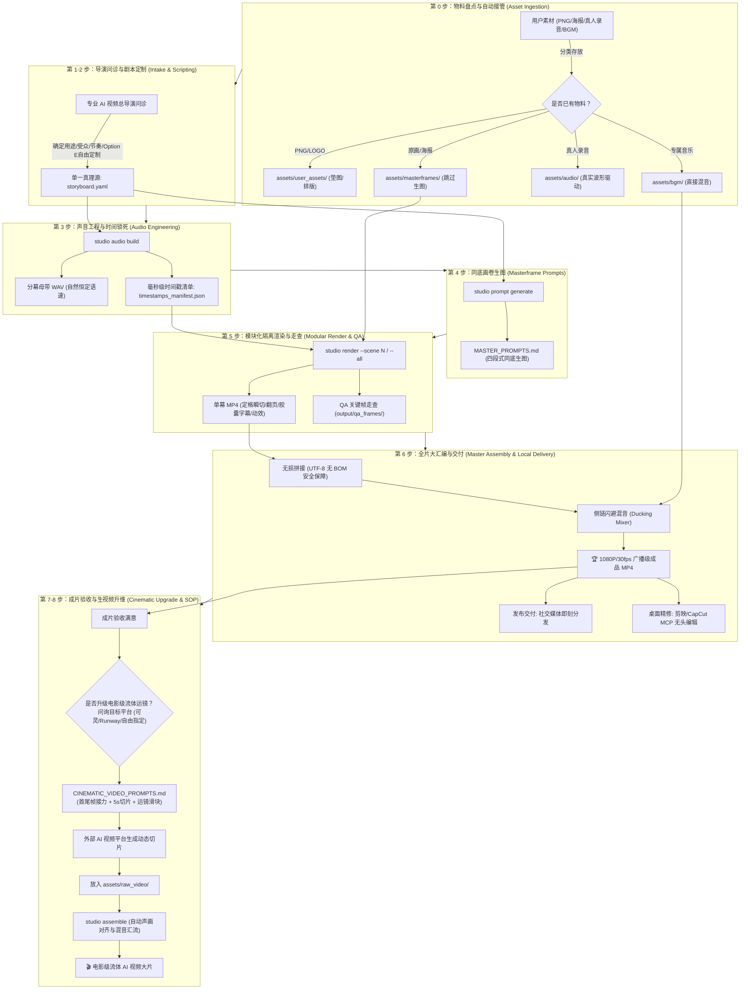

# 🎬 Human-AI Video Director (人机协同短视频工业化制作工坊)
### *From Concept & Assets to Broadcast-Grade 1080P MP4 and Cinematic AI Video Prompts in Minutes.*

[](https://www.python.org/)
[](https://opensource.org/licenses/MIT)
[](https://github.com/rany2/edge-tts)
[](https://ffmpeg.org/)
[](#-电影级-ai-运镜与生视频指令引擎-cinematic-directing-engine)
[](#-双轨交付与全套生态工具箱-dual-handover--ecosystem)

> 💡 **核心哲学：**  
> **“骨骼与节奏归确定性工程，灵魂与神态归生成式 AI。”**  
> *Deterministic Engineering for Timing & Layout, Generative AI for Aesthetics & Motion.*

告别纯代码硬搓假人立牌的生硬塑料感，告别纯大模型生视频的汉字乱码与界面形变。  
本项目将**大模型同底同质直出 (In-Context Conditioning)**、**参数化定格动画引擎 (studio CLI)**、**动态侧链混音**与**专业电影级生视频运镜指令**深度咬合，实现高完播率、印刷级质感与极高交付确定性的短视频工业化生产。

---

## ⚡ 为什么需要人机协同工坊？(The Paradigm Shift)

当前 AI 短视频制作的三大痛点与工坊破局之道：

| 生产维度 | 纯 AI 视频生成 (Pure Gen-Video) | 纯代码硬搓 (Remotion/代码拼贴) | 🌟 Human-AI Studio (本项目) |
| :--- | :--- | :--- | :--- |
| **汉字与版面** | ❌ 汉字乱码、品牌 LOGO 形变扭曲 | ✅ 排版清晰规整 | 🏆 **印刷级精准**：同底同质画卷锁死排版与文字 |
| **角色与主体** | ❌ 镜头切换时人物变脸、产品走样 | ❌ 假人立牌生硬，缺乏呼吸感与立体光影 | 🏆 **生动一致**：大模型锁定特征直出，3D/实拍质感拉满 |
| **运镜与动态** | ❌ 运镜随机不受控，多轴复合导致画面融化 | ❌ 仅能做简单平移缩放 | 🏆 **电影级运镜**：Camera First 工业级运镜指令直通外部平台 |
| **声音与节奏** | ❌ 音画脱节，语速忽快忽慢 | ⚠️ 依赖手动打点切片，门槛高耗时长 | 🏆 **声音即时间轴**：毫秒级时间戳单一真理源驱动全片 |
| **制作成本** | 💸 单条视频消耗昂贵算力，废片率 >70% | ⌛ 开发周期以天计算 | 🚀 **分钟级交付**：3 分钟同底生图，本地秒级渲染装配 |

---

## 🌟 五大核心工业化能力 (Core Superpowers)

### 1. 🎬 导演级自适应问诊与自由定制 (Adaptive Director Protocol)
- **拒绝死板套路**：彻底打破固定 5 幕限制，根据视频目标自适应匹配最佳节奏：
  - **10s ~ 15s 极速微短片 / 卡点爆款**：适配 **2 ~ 3 幕**（痛点唤醒 ➔ 核心亮相 ➔ 立即行动 CTA）；
  - **30s ~ 45s 中短视频 / 功能拆解**：适配 **3 ~ 4 幕**（痛点 ➔ 破局 ➔ 实操 ➔ 升华）；
  - **50s ~ 65s 深度干货 / 标杆大片**：适配 **黄金 5 幕**（痛点 ➔ 破局 ➔ 对决 ➔ 诊断 ➔ 升华）。
- **全要素自由定制与军火库生态融合**：
  - **美学自由定制（Option E）**：视觉风格除了现代科技 (`modern_tech`)、经典手账 (`journal_scrapbook`)、3D 黏土萌系风外，支持自由输入任意美学（如赛博朋克、复古胶片、日系极简暖色、手绘涂鸦等）；
  - **内置军火库能力融合**：前置问询是否联动生态军火库（手绘白板 `srt-whiteboard-animation`、极客代码讲解 `anything2explainer`、157+镜头配方 `video-shotcraft`、火柴人短剧 `stickman-video-director`、真人口播画中画 `cut-director`、或 3D WebGL 动效 `HyperFrames`）；
  - 转场支持纯硬切（Jump Cut）、2.5D 物理翻书或自由定制（快门闪白、推焦冲屏等）；
  - 画面主体支持静物特写、真人肖像、3D 吉祥物、爆炸拆解图或 UI 悬浮交互。

### 2. 📥 零摩擦已有素材自动接管 (Zero-Friction Asset Ingestion)
如果手头已有素材，流水线自动识别并无缝接管分流，免除二次重复生成：
- **产品透明底 PNG / 矢量 LOGO**：放入 `assets/user_assets/`（作为大模型生图垫图保持 100% 细节真实，或由引擎直接排版贴图）；
- **已有成套原画 / 实拍分镜海报**：放入 `assets/masterframes/`（**直接跳过第 4 步 AI 生图**，零重绘成本）；
- **真人口播录音 / 现成音频**：放入 `assets/audio/`（跳过 Edge-TTS，由真人真实声波时间戳驱动画面）；
- **专属定制 BGM**：放入 `assets/bgm/`（跳过 BGM 检索，直接对其施加侧链动态避让混音）。

### 3. 🎙️ 广播级声音工程与时间锁死 (Audio-First & Sidechain Ducking)
- **声音即时间轴（Audio-First）**：全片时长由配音波形起止点唯一决定，拒绝画面倒逼声音！
- **自然恒定语速（0% 逐句 atempo 强行变速）**：采用微软 Edge-TTS 神经网络音色（阳光青年男声 `Yunxi`、专家男声 `Yunjian`、知性女声 `Xiaoxiao`），以恒定自然速率直出，自动剥离头尾静音并补齐呼吸气口留白，产出全片单一真理源 `timestamps_manifest.json`；
- **动态侧链避让混音 (Sidechain Ducking)**：人声朗读时 BGM 自动平滑压低至 `12%`，停顿气口平滑回弹至 `25%`，人声干声清澈透亮，绝不喧宾夺主。

### 4. 🎥 电影级 AI 运镜与生视频实操 SOP 全案 (Cinematic Directing SOP & Multi-Shot Relay)
不仅提供提示词，更为外部大模型提供了一整套**图文强绑定、分镜头切片与首尾帧接力**的工业化落地全案（`CINEMATIC_VIDEO_PROMPTS.md`），全面适配**快手可灵 (Kling 3.0)、Runway Gen-3、Luma Dream Machine、海螺 AI (Minimax)、字节即梦 (Jimeng)**：
- **突破长视频生成限制 (Multi-Shot Chunking)**：针对主流平台单次只能生成 5s/10s 的硬件限制，工坊将全剧本按叙事节奏拆解为 3~5 秒独立微镜头切片，天然契合各平台 5s 生成窗口；
- **首尾帧无缝接力 (First-End Frame Relay)**：
  - **首帧 (First Frame)**：强绑定当前镜头母版原画（`assets/masterframes/SceneXX_pose_1.jpg`）；
  - **尾帧 (End Frame / 锚点)**：绑定末帧锚点（`assets/anchors/scene_XX_end.png`）或下一镜头首图，由平台推演两点间的自然物理形变与位移，**彻底根除镜头切换断崖与变脸**；
- **逐镜头实战任务卡 (Step-by-Step Production Cards)**：
  - 明确实操步骤：【1.首帧上传路径】➔【2.尾帧接力路径】➔【3.平台参数与运镜滑块建议】➔【4.一键复制专属指令】➔【5.回传保存路径】；
  - 严格恪守 **Camera First**（机位前置）、**One-Move Rule**（一镜一动）、运动幅度锁定在 `3~4`（防画面融化）；
- **外部视频本地自动汇流总装 (Round-trip Master Assembly)**：
  - 外部平台生成完成后，将视频放入 `assets/raw_video/`，本地执行 `python -m studio assemble` 即可自动由 `AIConformer` 完成 1080×1920 / 30fps 统一转码对齐，自适应延展末帧保证人声绝不被截断，并施加**动态侧链避让混音**！

### 5. 🧰 三轨交付与全套生态工具箱 (Tri-Handover & Ecosystem)
- **交付物 1（即刻发布）**：1080×1920 (9:16) / 30fps 广播级高清零水印成片 MP4；
- **交付物 2（桌面精修）**：借助内置 `mcp_chatcut_desktop` 协议，无头驱动剪映/CapCut 桌面端进行轨道微调与贴纸增补；
- **交付物 3（大模型运镜）**：开箱即用的生视频实战 SOP 全案，支持在外部 AI 视频平台一键生成生动大片并回流总装。

---

## 🏗️ 工业化全流程管线架构 (Pipeline Architecture)



---

## ⚡ 极速上手 (5-Minute Quickstart)

### 1. 环境准备
```bash
# 克隆仓库并安装 Python 依赖
git clone https://github.com/Bruceqiu67/human-ai-video-director.git
cd human-ai-video-director
pip install -r requirements.txt

# 验证 FFmpeg 可用性
ffmpeg -version
```

### 2. 初始化项目脚手架
```bash
# 一键生成标准分镜剧本模板
python -m studio init my_project
```
*根据构想修改 `my_project/storyboard.yaml` 中的台词、风格与音色（或交由 Agent 导演问诊全自动生成）。*

### 3. 一键构建声音母带与时间戳清单
```bash
# 自动生成自然恒定语速配音与毫秒级时间戳
python -m studio audio build --project my_project
```

### 4. 导出大模型同底画卷生图矩阵
```bash
# 一键导出生图画卷矩阵
python -m studio prompt generate --project my_project
```
*复制 `MASTER_PROMPTS.md` 指令至 Midjourney / Grok / Flux 出图，存入 `my_project/assets/masterframes/`。*

### 5. 场景隔离渲染与 QA 关键帧走查
```bash
# 渲染第一幕（或使用 --all 渲染全部）
python -m studio render --project my_project --scene 1
```
*自动在 `my_project/output/qa_frames/` 生成走查帧，肉眼复核无重影、文字锐利后即可推进。*

### 6. 全片大汇编与 BGM 动态侧链避让混音
```bash
# 挑选喜欢的 BGM 存入 assets/bgm/，执行一行命令总装
python -m studio assemble --project my_project
```
*成品视频立即交付至 `my_project/output/video/my_project_1080P_Final.mp4`！*

### 7. 电影级 AI 运镜与生视频升维 (可选进阶)
成片验收满意后，可唤醒生视频升级：
1. 告知 Agent 你所使用的 AI 视频平台（可灵/Runway/Luma/海螺/即梦/自由指定）；
2. 获取定制的 `CINEMATIC_VIDEO_PROMPTS.md` 实战任务卡；
3. 将生成的外部视频片段存入 `my_project/assets/raw_video/`；
4. 重新执行 `python -m studio assemble --project my_project`，秒级完成声画无缝总装！

---

## 📁 规范项目工程目录树 (Repository Layout)

```text
human-ai-video-director/
├── .gemini/skills/human-ai-video-director/   # Agent 核心 Skill (含交互式引导与全流程向导)
├── studio/                                  # 核心 Python 工业级引擎
│   ├── assembly/                            # 无损直拼与侧链闪避混音 (FFmpeg Sidechain)
│   ├── audio/                               # Edge-TTS、静音剪切与时间戳对齐
│   ├── core/                                # 配置解析、数据单真理源与子进程通信
│   ├── engine/                              # 5层定格渲染、2.5D翻书、自适应字幕与动效
│   ├── prompt/                              # 同底画卷矩阵与电影级生视频运镜生成器
│   └── styles/                              # 视觉美学解耦系统 (Modern Tech / Journal)
├── templates/default_project/               # 标准脚手架模板
├── video_tools_ecosystem/                    # 完整周边视频军火库 (剪映 MCP + 8大Skills)
├── projects/                                # 你的专属实战工程目录
│   └── <project_name>/
│       ├── assets/
│       │   ├── user_assets/                 # 用户自带物料 (产品 PNG / LOGO)
│       │   ├── masterframes/                # 各分镜母版原画 (命名: Scene01_pose_1.jpg)
│       │   ├── anchors/                     # 场景转场末帧锚点
│       │   ├── raw_video/                   # 外部 AI 平台生成的原始视频切片 (用于回流总装)
│       │   └── bgm/                         # 专属背景音乐 (如: pop_beat.mp3)
│       ├── audio/                           # 声音母带与 timestamps_manifest.json
│       ├── output/
│       │   ├── video/                       # 各幕单片与最终 1080P_Final.mp4
│       │   └── qa_frames/                   # 各幕走查关键帧
│       ├── storyboard.yaml                  # 项目单一真理源配置文件
│       ├── MASTER_PROMPTS.md                # 大模型同底画卷生图矩阵
│       └── CINEMATIC_VIDEO_PROMPTS.md       # 大模型图生视频/文生视频专业运镜指令
├── tests/                                   # 契约测试与冒烟测试 (100% 通过验证)
├── requirements.txt                         # 核心依赖清单
└── README.md                                # 项目主页
```

---

## 🧰 视频制作工具箱生态 (`video_tools_ecosystem/`)

本项目打包了顶尖的周边开源视频创作工具箱：

| 工具/技能名称 | 原开源项目仓库链接 | 核心特色与适用场景 |
| :--- | :--- | :--- |
| **`mcp_chatcut_desktop`** | 内置 MCP 协议中枢 | **剪映 / CapCut 桌面端自动化**：60 个原子工具直接操控本地剪辑轨道 |
| **`srt-whiteboard-animation`** | [geeklee/srt-whiteboard-animation](https://github.com/geeklee/srt-whiteboard-animation) | **暖白纸流墨手绘白板动画**：仿真实体笔触与手绘涂鸦 |
| **`anything2explainer`** | [Vincentwei1021/anything2explainer](https://github.com/Vincentwei1021/anything2explainer) | **黑底极简科技感讲解视频**：图灵宇宙风格，硬核算法与代码讲解 |
| **`video-shotcraft`** | [Vincentwei1021/video-shotcraft](https://github.com/Vincentwei1021/video-shotcraft) | **157+ 镜头配方卡与 2.5D 动效分镜工坊**：Remotion 视觉动效全家桶 |
| **`stickman-video-director`** | [kaomei/stickman-video-director](https://github.com/kaomei/stickman-video-director) | **火柴人叙事视频导演**：极低美术成本的幽默故事科普 |
| **`hand-drawn-video-prompts`** | [kaomei/hand-drawn-video-prompts](https://github.com/kaomei/hand-drawn-video-prompts) | **暖白底 Q 版蜡笔手绘 9:16 分镜**：高亲和力生活与职场指南 |
| **`cut-director`** | 内置实用 Skill | **口播切气口与画中画视觉导演**：真人视频智能切除停顿并弹出产品 UI |
| **`ffmpeg-video-editor`** | 内置实用 Skill | **FFmpeg 命令行高保真剪切转码工具** |
| **`yh-tools-video2srt`** | 内置实用 Skill | **离线/在线智能音视频提取字幕与时间戳** |

---

## 🛑 七大不可逾越工程红线 (The 7 Non-Negotiables)

1. **【未经明确拍板绝不擅自执行方案生片 (Strict Pre-Execution Sign-Off Gate)】**：向用户呈递策划提案、分镜剧本或制作方案后，**在用户没有明确给出肯定答复、正式拍板确认执行（如明确回复“开始”、“执行”、“确认方案”、“选方案A”等）之前，绝对不允许执行方案生成视频**！严禁擅自初始化项目配置、严禁合成音频、严禁调用生图或启动视频渲染总装，必须严格就地停步等待指令。
2. **【绝不擅自合并总片】**：单幕必须隔离渲染，经 QA 抽帧走查满意后方可总汇编。
3. **【绝不逐句强行变速】**：严禁在单句上滥用 `atempo` 强拉硬拽，声音自然流淌，画面绝对服从声音。
4. **【绝不切文字区做羽化】**：严禁在带有文字、卡片的区域做代码 Alpha 羽化拼合，100% 同底整页直出。
5. **【坚守同机位定格与动作密度】**：严禁单张死图硬撑 3 秒以上（单幕 $\ge 2.5$ 秒强制 $1.2\text{s} \sim 1.8\text{s}$ 微姿态递进）；严禁同一幕内随意换机位与背景穿帮，必须锁死三脚架；跳切瞬间施加 0.16s 物理微弹冲（Scale Punch），坚守生动定格质感。
6. **【字音毫秒同源绝对对应】**：字幕文本与配音文本单一数据源，字幕起止由真实声波波形严格驱动。
7. **【必须输出 QA 关键帧走查】**：自动抽取动作切换点与转场帧，肉眼复核文字锐度与构图后方可汇报交付。

---

## 📄 开源许可证 (License)

本项目遵循 [MIT License](LICENSE) 协议开源。欢迎提交 Issue 与 Pull Request！
