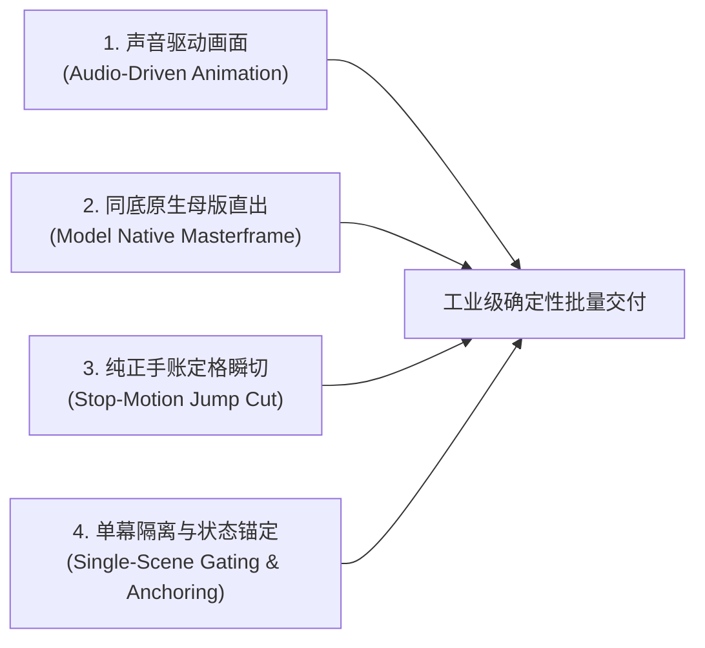
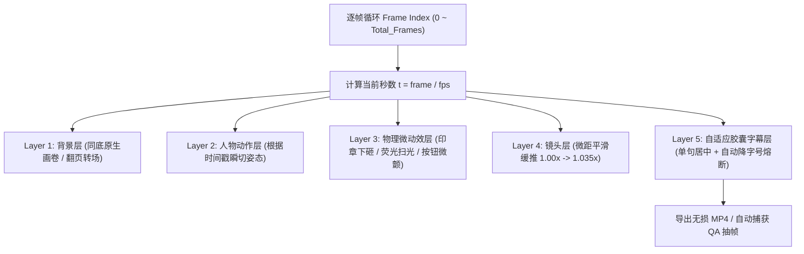

# 《通用高品质 AI 短视频批量生产工业化 SOP》
## (Universal AI Video Batch Production Pipeline & Architecture Manual)

> [!IMPORTANT]
> **本文档定位与适用场景**：
> 本手册将我们在《话术私教》项目中踩过的所有坑、验证成功的核心技术与人机协同工作流，提炼为一套**可复用、可迁移、工业化批量生产**的通用标准框架。
> 无论是产品推广、知识干货、功能拆解还是品牌叙事，后续任何视频项目均可直接套用此架构进行低成本、高效率、高确定性的批量生产。

---

## 一、 批量化生产的四大核心工程哲学 (Core Philosophies)



1. **声音驱动画面 (Audio-Driven Animation)**：
   - 彻底废除“先搭画面再拿音频变速凑时长”的倒装逻辑。声音具有人类听觉最敏感的语调和呼吸；**必须音频先行，由声音天然的停顿气口毫秒级驱动画面剪辑点**。
2. **同底原生母版直出 (Model Native In-Context Conditioning)**：
   - 彻底废除纯代码几何贴图与局部羽化缝合。背景、版式、文字、阴影 100% 依赖大模型基于母版在原位直出，仅置换人物姿态与核心高亮。
3. **实体定格瞬切，拒绝塑料伪动效 (Stop-Motion Jump Cut)**：
   - 严禁人物正弦摆动（Wiggle）与骨骼扭动。依托实体纸质手账的灵魂——**离散抽帧定格**，依靠高频切换（0.5s~1.0s）塑造鲜活生命力。
4. **单幕隔离过审与片尾锚定 (Single-Scene Gating & Anchoring)**：
   - 未验收单幕绝不合并总片。上一幕视频的真实末帧自动导出为下一幕翻页转场的起始锚点，确保幕间 100% 像素级无缝咬合。

---

## 二、 通用工程脚手架与目录标准 (Universal Project Scaffolding)

新建任何视频项目时，直接初始化以下标准目录结构：

```
Video_Project_Template/
├── 01_Docs/                          # 规范与策划文档
│   ├── SCRIPT_AND_STORYBOARD.md      # 5幕分镜台词剧本总表
│   └── PRODUCTION_LOG.md             # 制作演进日志
├── 02_Assets/                        # 资产库（分门别类，绝不乱丢）
│   ├── 01_Character_Ref/             # 出镜人物基准图库（五官、服饰锁定）
│   ├── 02_Masterframes/              # 大模型原生同底画卷（Scene01 ~ Scene05）
│   ├── 03_Cutouts_And_Stickers/      # 透明贴纸与局部动画切片（印章、铅笔等）
│   ├── 04_Audio_Raw/                 # BGM原曲、各类物理音效（翻书、盖印、叮响）
│   └── 05_Anchors/                   # 幕间衔接锚点（各幕真实最后一帧截图）
├── 03_Audio_Master/                  # 声音工程产物
│   ├── scene_XX_master.wav           # 严格锁定时长的人声音频母带
│   └── timestamps_manifest.json      # 全片台词毫秒级时间戳清单（唯一真理源）
├── 04_Video_Scenes/                  # 单幕独立渲染成片（Scene_01.mp4 ...）
├── 05_QA_Frames/                     # 质检抽帧目录（Scene_01/ ...）
├── 06_Final_Master/                  # 终极大片交付物（1080P_Final.mp4）
└── scripts/                          # 标准自动化脚本库
    ├── 01_build_audio.py             # TTS 声音母带生成与时间戳标定
    ├── 02_render_scene_XX.py         # 各幕定格动效渲染引擎
    └── 03_assemble_master_film.py    # 全幕无损汇编与 BGM 动态闪避混音
```

---

## 三、 黄金 5 幕剧本母版与时长公式 (Universal 5-Act Script Architecture)

竖屏短视频的黄金完播区间严格锁定在 **50 秒 ~ 65 秒** 之间，单幕时长由文字信息量决定（单字发音时长基准：`0.14s ~ 0.16s`，单句 9~22 字为佳）：

| 幕次 | 结构名称 | 核心心理动作 (Psychological Hook) | 推荐字数 | 推荐时长 | 视觉与动效标配 |
| :---: | :--- | :--- | :---: | :---: | :--- |
| **Act 1** | **痛点觉醒 (Hook)** | 突发冲突、共情暴击、打破平衡 | 60~75 字 | 10~12s | 突发警告、情绪五连定格瞬切、撕纸飞离、痛点微距缓推 |
| **Act 2** | **破局重构 (Solution)** | 心理减负、引入主角、全景地图 | 75~90 字 | 12~14s | 2.5D 手账折页翻入、手托引导 ➔ 食指点划、荧光笔横扫划亮 |
| **Act 3** | **拟真对战 (Simulation)** | 极客对决、深度体验、零险排雷 | 70~85 字 | 12~14s | 点击挑战脉冲波、跳动声波律动柱、通关盖印、抱胸自信 |
| **Act 4** | **深度诊断 (Insight)** | 残暴打分、颠覆认知、干货解法 | 90~110 字 | 14~17s | 45分印章下砸屏幕震颤、耸肩 ➔ 托腮 ➔ OK自信、科学短句胶囊字幕 |
| **Act 5** | **通关号召 (CTA)** | 终极爽感、能力升华、立即行动 | 55~70 字 | 9~11s | 官方图标弹性跳出、握拳 ➔ 点赞通关、扫光掠过、金币清脆音效 |

---

## 四、 声音工程标准化管线 (Audio Engineering SOP)

### 1. 声音参数黄金标准
- **推荐音色**：微软官方高保真演播声线 **`zh-CN-YunjianNeural`**（质感沉稳专业、咬字紧凑、无杂音）。
- **自然语速基准**：在 TTS 引擎层面统一配置 `rate=+18% ~ +20%`。
- **气口规约**：逗号留白 `0.20s`，句号留白 `0.30s~0.40s`，严禁句子粘连。
- **绝对红线**：**0% 逐句 atempo 强拉硬扯！** 严禁用不同倍率强行压缩/拉伸单句配音。

### 2. 音字毫秒同源 (Single Source of Truth)
通过脚本在生成音频的同时，导出结构化时间戳字典：
```python
# 示例：01_build_audio.py 导出的标准时间戳结构
SCENE_TIMESTAMPS = [
    {"start": 0.00, "end": 2.25, "text": "刚开口，就被客户秒挂！", "pose": "Pose1_通话"},
    {"start": 2.25, "end": 4.80, "text": "面对客户的现在忙，大脑一片空白不知如何回复。", "pose": "Pose2_看手机"},
    {"start": 4.80, "end": 7.30, "text": "新人缺乏异议经验，根本留不住客户！", "pose": "Pose3_叹气"},
]
```
> **收益**：视频渲染脚本直接引用该清单驱动画面，字幕文字与配音 100% 逐字对应，绝对杜绝脱节。

---

## 五、 大模型同底画卷批量提示词模版 (Master Prompt Engineering)

为了让外部生图大模型（Grok / Midjourney / Gemini）能够稳定产出不走样的同底原生画卷，使用以下**四段式标准化提示词模版**：

```markdown
### 通用工业级生图 Prompt 模版

9:16 竖版 (1080x1920)，【杂志折页手账风 · 纸片人定格拼贴】。

【参考图约束 (Reference Constraints)】：
1. 严格锁定参考图1的背景基底：暖米白色糙面网格纸底 (#FAF7F2)、居中纵向装订折痕与暗部阴影、浅灰工程标尺辅助线、左下角斜放的银色自动铅笔。
2. 严格锁定参考图2出镜人物五官长相：青年男性，黑色短发，细黑框长方形眼镜，黑色纯色圆领短袖T恤。人物轮廓带精准 15px 剪纸纯白边框，带真实柔和自然投射阴影。

【版面文字与排版结构 (100% 排版锁定)】：
- 顶部英文小标题：STAGE 0{幕次编号} // {英文阶段名，如 REALITY CHECK}
- 顶部主标题（思源粗黑体印刷黑）：{本幕核心主标题，如“第一次练只有45分？”}
- 左侧手账便签卡片：{便签主题与列点干货内容}
- 周边辅助元素：手绘荧光橙马克笔高亮线、涂鸦铅笔小箭头。

【动态置换区：人物肢体与表情 (Pose Replacement Only)】：
- 人物位于右侧，姿态：{明确的人物肢体动作，例如：单手托腮、身形微侧前倾、眼神聚焦左侧建议栏，专注研读}。
- 绝不改动左侧文字、卡片、背景折痕与顶部标题！人物必须与背景光影浑然一体。
```

---

## 六、 代码化定格渲染引擎架构 (Modular Render Engine)

使用 Python (Pillow + NumPy + MoviePy/FFmpeg) 构建通用渲染基类，各幕仅需继承并重载核心时间线：



### 核心动效标准算法速查：
1. **2.5D 手账折页翻书 (Page Flip)**：
   - 载入上一幕末帧，右侧边缘根据 `progress` 施加三角卷边透视与背面阴影，底层透出本幕新画卷，时长 `0.6s~0.7s`。
2. **定格抽帧瞬切 (Stop-Motion Jump Cut)**：
   - 在台词时间戳的 `start` 瞬间直接切换整张原生画卷，画面无平滑插值，纯粹实体切张。
3. **复古印章弹跳下砸 (Stamp Impact)**：
   - 触发时刻缩放从 `2.5x` 快速缩小至 `1.0x`（衰减震荡 `scale = 1.0 + 0.3 * exp(-12*dt) * cos(30*dt)`），画面配合 4 帧微幅抖动。
4. **自适应字幕防溢出 (Adaptive Subtitle)**：
   - 计算字幕渲染像素宽度，若 `text_w > 920px`，自动等比递减字号直至安全边界内，100% 杜绝截断。

---

## 七、 质量门禁与 QA 走查规约 (Quality Assurance SOP)

每完成一幕渲染，脚本必须自动执行以下质检流程，人工走查通过后方可推进：

```
[Quality Gate 检查清单]：
□ 1. 声音走查：听感是否自然稳健？有无忽快忽慢？气口是否舒适？
□ 2. 文字无损：文字区有无切片羽化导致的断裂、重影或错位？
□ 3. 字音毫秒对齐：配音发音点与字幕出现点是否完全同步？
□ 4. 字幕边界：最长的一句台词是否在屏幕安全框（左右各预留 80px）以内？
□ 5. 动效纯正：有无塑料感平滑晃动？是否坚持了纯定格跳切？
□ 6. 锚点截取：是否已成功保存本幕最后一帧为下一幕的起始底板？
```

---

## 八、 全片大合流与智能 BGM 动态闪避混音 (Master Assembly)

全幕验收完成后，通过统一汇编脚本执行大合流：

1. **无缝拼接 (Lossless Concat)**：基于 FFmpeg Concat Demuxer 对 5 幕独立视频进行无缝拼接。
2. **智能音频闪避 (Audio Ducking)**：
   ```bash
   # FFmpeg 动态侧链闪避标准滤镜：人声出现时 BGM 压低至 12%，人声停顿时 BGM 平滑回弹至 25%
   [1:a]asplit=2[sc][bgm];[0:a][sc]sidechaincompress=threshold=0.08:ratio=8:attack=30:release=350[voice_ducked];[bgm]volume=0.12[bgm_low];[voice_ducked][bgm_low]amix=inputs=2:duration=first[aout]
   ```
3. **成品压制**：统一压制为 `1080x1920`, `30.0fps`, `CRF 18`, `H.264 High Profile`, `AAC 320kbps`, `+faststart` 竖版成片。

---

## 九、 批量生产核心避坑红线速查表 (The Non-Negotiables)

| 场景 | 严禁触碰的歧路 (Anti-Patterns) | 工业化正道 (Standard Best Practices) |
| :--- | :--- | :--- |
| **画面排版** | 纯代码 PIL 画方块、贴系统字体 | 100% 大模型同底母版直出，印刷级真实感 |
| **人物动态** | 代码 `sin(t)` 正弦左右摇摆 (Wiggle) | 实体定格抽帧跳切 (Stop-Motion Jump Cut) |
| **多姿态融合** | 文字卡片区做代码切片与渐变羽化 | 模型整页同底直出，严禁在文字区动刀 |
| **配音处理** | 逐句施加 `atempo` 变速强凑时长 | 声音驱动画面，恒定自然语速，留足气口 |
| **字幕生成** | 渲染脚本与配音文案各自维护文本 | 单一数据源（Single Source of Truth），字音同源 |
| **交付流程** | 没调好单幕就直接合并总片 | 单幕独立渲染、QA 抽帧验收、保存末帧锚点后再推进 |
